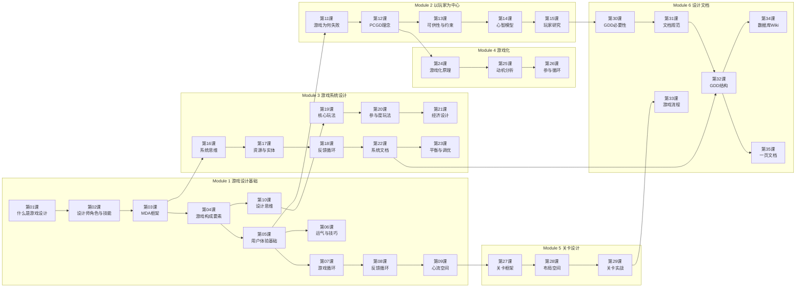

# 课程路线图

## 学习路径总览

## 模块依赖关系

| 模块 | 前置模块 | 来源课程数 | 课时 |
|------|---------|-----------|------|
| M1 游戏设计基础 | 无（入门起点） | 2 | 10课 |
| M2 以玩家为中心 | M1-05 (用户体验) | 1 | 5课 |
| M3 游戏系统设计 | M1-03 (MDA), M1-10 (设计思维) | 2 | 8课 |
| M4 游戏化 | M2-12 (PCGD) | 1 | 3课 |
| M5 关卡设计 | M1-09 (心流) | 1 | 3课 |
| M6 设计文档 | M2-15 (玩家研究), M3-22 (系统文档) | 2 | 6课 |

## 建议学习节奏

**密集模式（每天学习）**：
- 每天 1-2 课（含练习约 1-1.5 小时）
- M1: 5-7天 → M2: 3-4天 → M3: 5-6天 → M4: 2天 → M5: 2天 → M6: 4天
- 总计约 4-5 周

**标准模式（工作日+周末）**：
- 工作日每天 1 课，周末 2-3 课
- 总计约 6-8 周

**宽松模式**：
- 每天 1 课或隔天 1 课
- 总计约 8-12 周