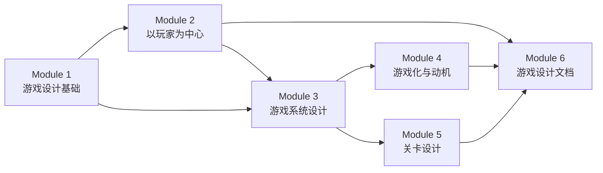

# 游戏设计完整学习路线

> **目标**：从零基础 → 能够独立完成游戏设计全流程 → 开发属于自己的游戏
> **素材**：9门专业游戏设计课程，348节中文字幕课
> **时长**：预计 8-12 周（每天学习）

---

## 模块总览

| 模块 | 名称 | 来源课程 | 课时 | 学习目标 |
|------|------|---------|------|---------|
| 1 | 游戏设计基础 | Essentials + For Developers | ~30课 | 掌握核心概念、术语、设计思维 |
| 2 | 以玩家为中心 | Player-Centered Game Design | ~25课 | 学会从玩家视角思考设计 |
| 3 | 游戏系统设计 | Master Systems + Indie System | ~35课 | 能设计自洽的游戏系统 |
| 4 | 游戏化与动机 | Gamification | ~15课 | 能设计玩家参与循环 |
| 5 | 关卡设计 | Level Design Essentials | ~15课 | 能设计基本关卡架构 |
| 6 | 游戏设计文档 | Documentation + GDD | ~30课 | 能撰写专业游戏设计文档 |

---

### Module 1: 游戏设计基础

**来源课程**：Game Design Essentials + Game Design for Game Developers

1. [[0001-what-is-game-design|什么是游戏设计？]]
2. [[0002-role-of-game-designer|游戏设计师的角色与技能]]
3. [[0003-mda-framework|MDA框架与游戏设计理论]]
4. [[0004-game-elements|游戏的构成要素分析]]
5. [[0005-user-experience-basics|用户体验基础]]
6. [[0006-luck-and-skill|运气与技巧的平衡]]
7. [[0007-game-loops|游戏循环]]
8. [[0008-feedback-loops|反馈循环]]
9. [[0009-flow-space|心流空间]]
10. [[0010-design-thinking-process|设计思维过程]]

### Module 2: 以玩家为中心的设计

**来源课程**：Player-Centered Game Design

1. [[0101-why-games-fail|游戏为什么失败]]
2. [[0102-pcgd-intro|以玩家为中心的设计理念]]
3. [[0103-affordances-constraints|可供性与约束]]
4. [[0104-mental-models|玩家心智模型]]
5. [[0105-player-research|玩家研究方法]]

### Module 3: 游戏系统设计

**来源课程**：Master Game Systems + Indie Game System Design

1. [[0201-systems-thinking|系统思维基础]]
2. [[0202-resources-entities|资源与实体]]
3. [[0203-feedback-loops-systems|系统中的反馈循环]]
4. [[0204-core-gameplay|构建核心玩法]]
5. [[0205-engagement-gameplay|参与度玩法]]
6. [[0206-economy-design|游戏经济设计]]
7. [[0207-system-documentation|系统设计文档]]
8. [[0208-balance-tuning|游戏平衡与调优]]

### Module 4: 游戏化与动机设计

**来源课程**：Gamification

1. [[0301-gamification-principles|游戏化核心原理]]
2. [[0302-player-motivation|玩家动机分析]]
3. [[0303-engagement-cycles|参与循环设计]]

### Module 5: 关卡设计

**来源课程**：Level Design Essentials

1. [[0401-level-design-frameworks|关卡设计框架]]
2. [[0402-level-layout|关卡布局与空间设计]]
3. [[0403-building-levels|制作关卡实战]]

### Module 6: 游戏设计文档

**来源课程**：Documentation + GDD Writing

1. [[0501-gdd-importance|为什么需要GDD]]
2. [[0502-documentation-standards|文档规范与标准]]
3. [[0503-gdd-structure|GDD结构详解]]
4. [[0504-game-flows|游戏屏幕流程设计]]
5. [[0505-database-wiki|数据库与Wiki管理]]
6. [[0506-one-page-design|一页设计文档]]

---

## 学习建议

- **每个模块学完后**，尝试用所学知识分析和拆解你喜欢的游戏
- **Module 3 学完后**，尝试为一个简单游戏构思设计核心玩法
- **Module 6 学完后**，尝试为一个完整的游戏构思撰写GDD
- **保持实践**：每节课后完成自测练习，再做一个小型设计练习

## Next Steps

开始你的第一课 → [[0001-what-is-game-design|什么是游戏设计？]]
