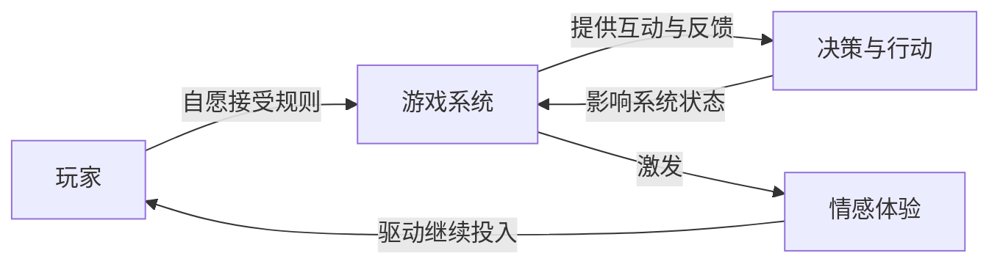

# 第01课：什么是游戏设计？

## Learning Objectives

- 理解**游戏**与**纯粹玩耍**之间的核心区别
- 掌握游戏的基本构成要素：规则、目标、互动、情感
- 理解**设计**作为创造性问题解决学科的本质
- 认识游戏开发团队中的其他角色及其与设计师的协作关系

## Core Idea

游戏（**Game**）不同于纯粹玩耍（**Play**）。纯粹玩耍没有规则，也没有明确目标——就像小狗互相追逐嬉闹。而游戏则包含：

1. **规则** -- 约束玩家在游戏系统中的行为
2. **目标** -- 玩家通过努力追求的结果
3. **互动** -- 有意义的、持续的决策与反馈循环
4. **情感** -- 游戏是"情感的引擎"（Tynan Sylvester）

> 玩家**自愿**接受规则，通过互动做出决策，以实现目标，并在此过程中被游戏唤起情感。

设计（**Design**）是一门创造性解决问题的学科。设计的核心是以用户为中心——作为游戏设计师，你始终是**玩家体验的主要倡导者**。

## Team Roles in Game Development

| 角色 | 核心职责 |
|------|---------|
| **程序员/编码员** | 将设计和美术元素实现到引擎中 |
| **艺术家/模型师/动画师** | 赋予游戏视觉外观与生命力 |
| **制作人/项目经理** | 确保开发流程顺畅、按时交付 |
| **营销团队** | 连接游戏与玩家，实现商业可持续 |
| **音效设计/音乐** | 创造情感共鸣的声音体验 |

> 游戏设计师越了解其他角色的工作，沟通就越高效，设计也越能贴合团队的时间与预算限制。

## Worked Example

以《俄罗斯方块》为例分析游戏要素：

- **规则**：七种不同形状的方块从顶部下落，玩家可以旋转和移动它们
- **目标**：填满水平行以消除得分，防止方块堆叠到顶部
- **互动**：玩家通过按键控制方块的移动、旋转和加速下落
- **情感**：紧张（方块不断堆积）、成就感（消除多行）、挫败感（操作失误）

## Practice

> [!QUESTION] 自我检测：以下哪些是"游戏"？哪些只是"纯粹玩耍"？
> 1. 一群孩子在操场上互相追逐
> 2. 两名玩家在棋盘上下国际象棋
> 3. 一只猫在追逐毛线球
> 4. 一组玩家在《我的世界》中合作建造城堡

查看答案

1. **纯粹玩耍** -- 没有明确的规则和目标，只是自由活动
2. **游戏** -- 有明确规则、目标（将死对方王）、玩家自愿参与
3. **纯粹玩耍** -- 动物本能行为，没有规则约束
4. **游戏** -- 虽然有创造的自由，但《我的世界》有生存模式规则、生命值、资源管理等正式游戏系统

关键判断标准在于：是否有**明确的规则**、**可追求的目标**，以及玩家是否**自愿接受这些约束**来获得情感体验。

## Next Step

Continue with the next lesson or complete the review task above before moving on.
