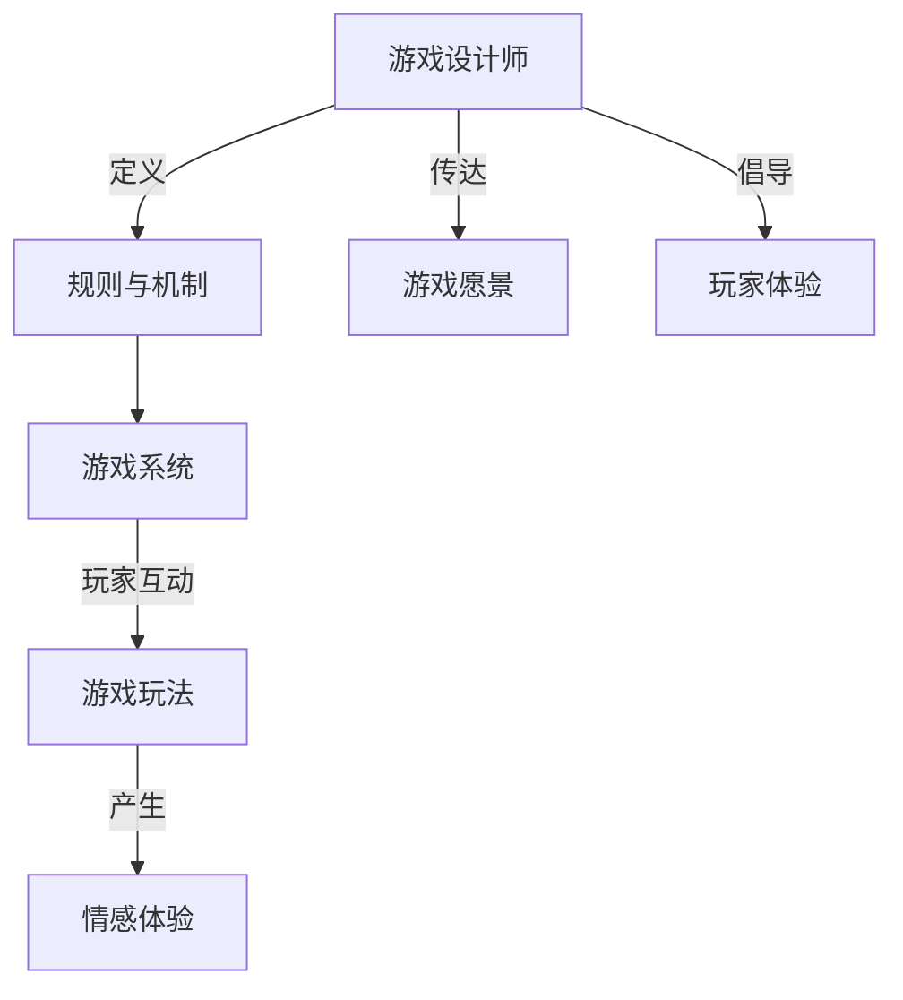

# 第02课：游戏设计师的角色与技能

## Learning Objectives

- 澄清游戏设计师的三大常见误解
- 理解**二阶设计**（Second-order Design）的概念
- 掌握游戏设计师作为**沟通者**与**情感架构师**的角色
- 了解游戏设计师所需的核心技能矩阵

## Core Idea

### 游戏设计师不是什么

| 误解 | 纠正 |
|------|------|
| **"创意人"** | 任何人都能想出好主意，设计师的工作不止于此 |
| **程序员** | 设计师可以有编程背景，但不负责编程实现 |
| **图形设计师/艺术家** | 设计师可以有艺术背景，但核心职责不同 |

### 游戏设计师是什么

游戏设计师负责通过**规则、机制和系统**，为玩家设计所需的**体验**。

### 二阶设计（Second-order Design）

游戏设计是**二阶设计**：设计师定义系统的各个部分（引擎），但玩家如何驾驶由玩家决定。设计师基于对玩家体验的良好猜测来定义系统，但玩家可能体验到与预期截然不同的情感。

> 机制对于游戏设计师而言，就像和弦进行对于音乐家一样 -- 你必须知道某些机制会引发什么类型的情感。

### 棘手问题（Wicked Problems）

游戏设计中的大多数问题属于**棘手问题**：没有明确解决方案，也没有一个方案能完美适用于两个看似相同的问题。这就是为什么成功游戏的续作有时会失败——我们无法确定玩家会如何反应。

### 必备技能矩阵

**对少量事情了解很多**（深度）：
- **游戏设计**本身 -- 多读书、多分析、多玩游戏

**对很多事情了解一点**（广度）：

| 技能 | 重要性 |
|------|--------|
| **设计思维** | 学习设计方法和设计方法论 |
| **系统思维** | 游戏本质上是系统性的 |
| **心理学** | 理解动机、情感、认知负荷 |
| **用户体验（UX）** | 创造更好的交互体验 |
| **写作与文档** | Word —— 清晰传达设计文档 |
| **演示能力** | PowerPoint —— 向团队展示设计愿景 |
| **数据分析** | Excel —— 建模和平衡游戏数值 |
| **数学与概率** | 确定随机事件的发生概率 |
| **编程** | 创建数字原型，理解开发约束 |
| **绘画/图像编辑** | 快速可视化想法，促进沟通 |
| **经济设计** | 若有游戏经济系统则极为加分 |

> 设计师是**晚熟的**——耐心积累，好奇心驱动持续学习。正如 Jesse Schell 在《游戏设计的艺术》中所说："我是一名游戏设计师。"

## Worked Example

**场景**：设计一个RPG中的"暴击"机制

- **深度技能应用**：理解概率分布对玩家体验的影响（数学+心理学）
- **广度技能应用**：用Excel建模不同暴击率下的伤害期望（数据分析）；用PPT向团队展示设计方案（演示）；通过与程序员沟通技术约束（编程理解）

设计师需要判断：5%暴击率+300%暴击伤害 vs 20%暴击率+150%暴击伤害，哪个带来更好的玩家情感体验？

## Practice

> [!QUESTION] 自我检测：以下哪些是二阶设计的体现？
> 1. 设计师规定玩家按下A键时角色跳跃
> 2. 设计师设计了一个"火焰"效果，期望玩家感到恐惧，但玩家觉得滑稽
> 3. 设计师编写了游戏的网络同步代码
> 4. 设计师给"盾牌"设计了一个格挡窗口，玩家发现可以用它来"弹反"并进行速通

查看答案

1. **不是** -- 这是一阶设计，直接定义了输入和输出的映射关系
2. **是** -- 设计师期望的情感（恐惧）与玩家实际体验（滑稽）不同，这正是二阶设计的核心挑战——玩家以不可预测的方式体验设计
3. **不是** -- 这是程序员的工作，不是游戏设计师的职责
4. **是** -- 设计师设计了格挡窗口，但玩家发现了一个设计师未预期的"emerging gameplay"（涌现玩法），这种玩家创造性使用系统的方式正是二阶设计的魅力所在

二阶设计的本质：**设计师控制系统，但无法完全控制玩家的体验方式。**

## Next Step

Continue with the next lesson or complete the review task above before moving on.
