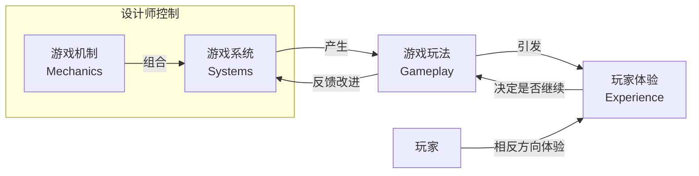

# 第03课：MDA框架与游戏设计理论

## Learning Objectives

- 了解 **MDA 框架**（Mechanics-Dynamics-Aesthetics）及其局限性
- 掌握 **MGE 框架**（Mechanics-Gameplay-Experience）
- 理解游戏设计的三个层次及其关系
- 学会从机制、玩法和体验三个角度分析和设计游戏

## Core Idea

### MDA 框架

**MDA** 代表 Mechanics（机制）、Dynamics（动态）、Aesthetics（美学），是最著名的游戏设计框架之一：

| 层次 | 定义 |
|------|------|
| **Mechanics（机制）** | 游戏的内部组成部分，设计师直接控制和创造的元素 |
| **Dynamics（动态）** | 游戏动态，即通常所说的"玩法"（gameplay） |
| **Aesthetics（美学）** | 玩家在游戏中实现的"幻想"与情感反应 |

> 本课程认为 MDA 已不再足够有用——术语随着游戏发展已发生巨大变化，且原始论文阐述不够充分。

### MGE 框架（推荐）

由 Robert Zubek 创建的 **MGE**（Mechanics, Gameplay, Experience）框架提供了更清晰的视角：

### 三个核心层次

1. **机制与系统（Mechanics & Systems）** -- 设计师完全控制
   - 机制是玩家参与的独立行动
   - 多个机制组合形成游戏系统
   - 设计师可以平衡、添加或移除连接

2. **游戏玩法（Gameplay）** -- 确定性降低
   - 玩家如何使用系统和机制
   - 设计师有大致了解，但无法考虑所有排列组合

3. **体验（Experience）** -- 最抽象
   - 玩家在游戏前、中、后感受到的情绪
   - 设计师没有直接控制权，但必须在设计时考虑

### 玩家视角的逆向体验

玩家通常以**相反方向**体验游戏：
1. 先因**体验**（如放松、刺激）而开始游戏
2. 基于**玩法**是否有趣而继续
3. 随着新**机制**和系统的加入保持新鲜感

## Worked Example

以《城市：天际线》为例分析三层次：

| 层次 | 内容 |
|------|------|
| **机制** | 规划道路、划分区域、设置预算、管理资源 |
| **系统** | 交通系统模拟、经济系统、市民满意度系统 |
| **玩法** | 玩家在有限预算下平衡城市扩张与市民需求 |
| **体验** | 创造的成就感、解决交通拥堵的满足感、城市破产的挫败感 |

设计决策：如果希望玩家获得"轻松创造"的体验，就不应添加过于复杂的政治系统；如果目标是"深度管理"，则适当增加系统复杂度。

## Practice

> [!QUESTION] 自我检测：为以下场景选择合适的框架分析
> 场景：你正在设计一款潜行游戏。玩家控制一名小偷，需要在警卫巡逻的大厦中窃取宝物。请用 MGE 框架分别列出：
> 1. 机制层面应该包含什么？
> 2. 玩法层面预期是什么样的？
> 3. 体验层面应该追求什么？

查看答案

1. **机制层面**：
   - 移动（行走/奔跑/蹲伏）
   - 视野系统（警卫的视野锥）
   - 声音系统（脚步声吸引注意）
   - 偷窃交互（在目标物品前按交互键）
   - 隐藏机制（躲在阴影中或柜子里）
   - 警报系统（被发现后触发）

2. **玩法层面**：
   - 玩家规划潜入路线
   - 观察警卫巡逻模式，寻找时机
   - 在风险与回报之间做选择（快速通过 vs 安全等待）
   - 被发现后寻找逃生路线或躲藏

3. **体验层面**：
   - 紧张感（时刻担心被发现）
   - 聪明感（成功智胜AI时的满足）
   - 掌控感（完美执行计划时的成就感）

**关键检查**：这些机制是否创造了预期的玩法？玩法是否支持预期的体验？如果发现玩家体验变成了"挫败"而非"紧张"，就需要调整机制（如增加提示、调整警卫AI的敏感度）。

## Next Step

Continue with the next lesson or complete the review task above before moving on.
