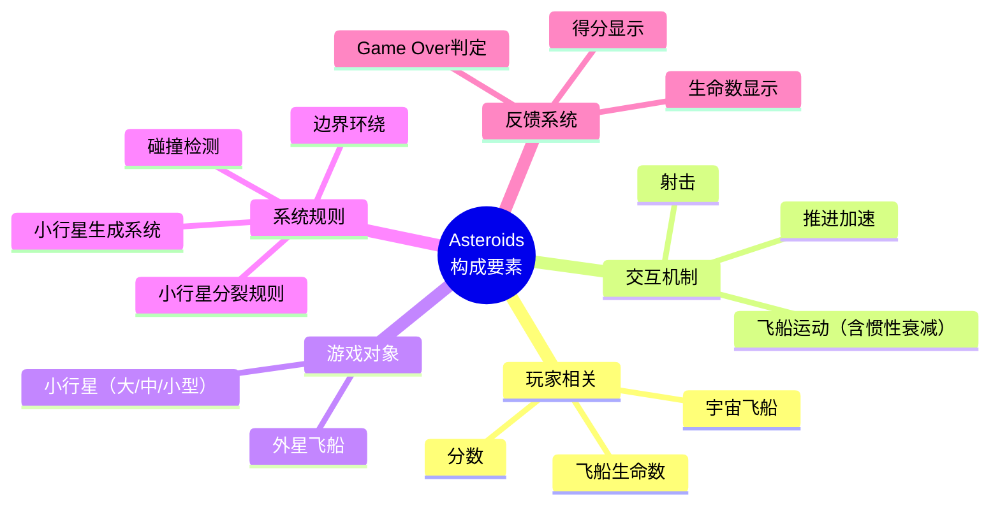
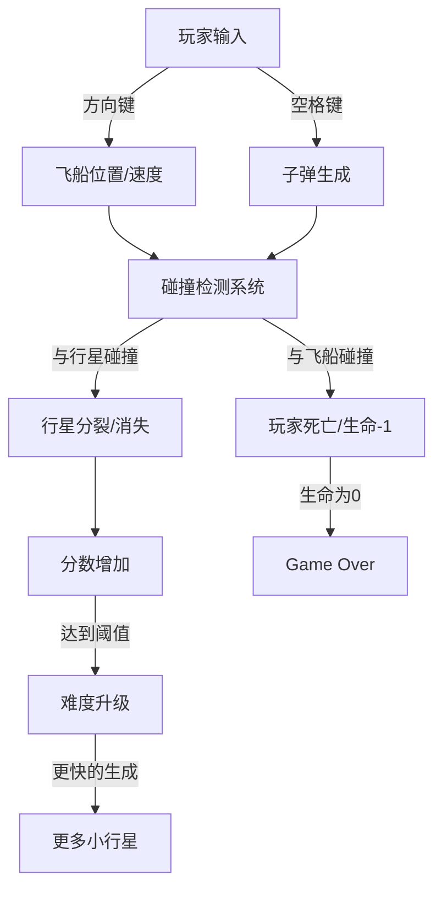

# 第04课：游戏的构成要素

## Learning Objectives

- 通过经典游戏《小行星》（Asteroids）识别游戏的基本构成要素
- 区分**游戏机制**（Mechanics）和**游戏系统**（Systems）
- 理解规则如何决定系统中的元素行为
- 认识到即使最简单的游戏也包含复杂的设计内容

## Core Idea

### 《小行星》要素分析实践

经典游戏《小行星》看似简单，但其内容足以填满一份完整的游戏设计文档（**GDD**）。

### 关键设计问题

在分析游戏时，设计师需要关注以下问题：

| 问题 | 设计思考 |
|------|---------|
| 得分规则是怎样的？ | 摧毁小行星的得分是否固定？不同大小得分不同？ |
| 飞船运动如何实现？ | 是否有惯性衰减？加速和减速的曲线如何设计？ |
| 小行星如何生成？ | 生成位置、方向、速度由什么规则决定？ |
| 碰撞如何判定？ | 什么情况下算击中？什么情况下玩家受损？ |
| 难度如何递增？ | 随着分数增加，小行星生成速度是否加快？ |

### 从要素到系统

这些要素不是孤立的，它们通过**规则**连接形成**系统**：

## Worked Example

**深度分析**：小行星的"惯性衰减"设计

这是《小行星》最具特色的设计之一。飞船在推进后不会立即停止，而是遵循物理学惯性：

- **机制层面**：按下"上"键时在飞船当前方向上施加加速度
- **系统层面**：速度向量持续作用，不衰减（或缓慢衰减）
- **玩法影响**：玩家需要预判运动轨迹，提前减速或转向
- **体验效果**：营造太空中的漂浮感，增加操作技巧深度

这一看似简单的设计选择，决定了整个游戏的**手感**和**技巧上限**。如果去掉惯性，游戏将变成简单的上下左右移动，深度大打折扣。

## Practice

> [!QUESTION] 自我检测：选择一款你熟悉的游戏，尝试列出其要素
> 以《超级马里奥》为例，你能列出多少构成要素？
> 提示：思考玩家角色、敌人对象、关卡元素、系统规则、反馈机制...

查看答案

《超级马里奥》的构成要素至少包括：

**玩家相关**：
- 马里奥（可变大/变小/火力花形态）
- 生命数（3条命，可增加）
- 分数/金币计数

**交互机制**：
- 移动（左右方向）+ 跳跃（力度与高度）
- 加速跑
- 踩敌人（从上方）
- 顶问号砖块

**游戏对象**：
- 蘑菇敌人（移动方式固定）
- 乌龟敌人（可踩壳踢壳）
- 金币
- 问号砖块/普通砖块
- 管道
- 旗杆（关卡终点）

**系统规则**：
- 碰撞判定（踩 vs 被撞）
- 时间倒计时
- 生命耗尽 → Game Over
- 关卡通关条件（到达旗杆）
- 变大/变小状态转换

**反馈系统**：
- 得分数字弹出
- 金币收集音效
- 死亡动画与重置
- 关卡通过的旗帜下降动画

即使是1985年的游戏，其构成要素也相当丰富。关键不在于要素的数量，而在于它们如何通过规则连接成有意义的系统。

## Next Step

Continue with the next lesson or complete the review task above before moving on.
