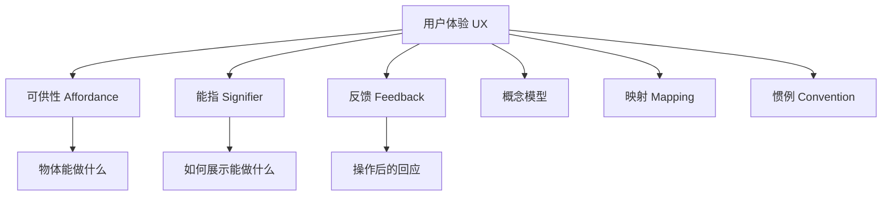
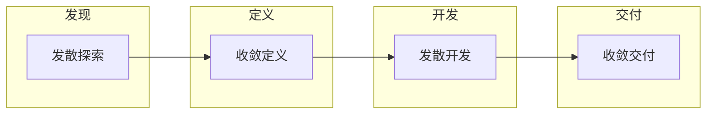

# 第05课：用户体验基础

## Learning Objectives

- 理解**用户体验（UX）**在游戏设计中的核心地位
- 掌握交互设计的关键原则：**可供性**（Affordance）、**能指**（Signifier）、**反馈**（Feedback）
- 了解**概念模型**（Conceptual Model）、**映射**（Mapping）与**惯例**（Convention）
- 认识**格式塔原则**（Gestalt Principles）在游戏UI中的应用
- 学习**双钻模型**（Double Diamond Model）设计流程

## Core Idea

### 用户体验（UX）概述

用户体验设计的核心是理解**人**如何与**产品**互动，并确保这种互动是**愉悦的**、**易于理解的**。

> 你希望玩家不需要说明书就能直观地理解游戏——那些"不需要意识到"的交互越多，教程的需求就越少。

### 交互设计六大原则

#### 1. 可供性（Affordance）

可供性是指物体**能做什么**的物理和功能属性。椅子可以坐，也可以搬动。但需要从**以人为中心**的角度看待：如果一个人坐不上去或搬不动，那么这个物体对这个特定的人就不具备这些可供性。

**反可供性**（Anti-affordance）：玻璃是透明的（允许看穿），但也是固体的（防止穿透）。

#### 2. 能指（Signifier）

能指是**展示用户可以进行什么操作**的视觉提示。可供性定义了什么能做，能指告诉用户怎么做。

| 例子 | 可供性 | 能指 |
|------|--------|------|
| 抽屉 | 可以被拉开 | 把手形状暗示"拉" |
| 梯子 | 可以攀爬 | 横档间距暗示"踩踏位置" |
| 杯子 | 可以盛放液体 | 凹面+把手暗示"握持和填充" |
| 游戏中的门 | 可以打开 | 靠近时出现"按A"提示 |

#### 3. 反馈（Feedback）

反馈是**对交互操作的即时回应**，应在0-3秒内给出。每一次玩家操作都应该有反馈，告知操作是否完成、是否成功。

- **好的反馈**：按下按钮，按钮发光 + 发出"咔嗒"声
- **差的反馈**：触摸式按钮无物理反馈，用户不确定是否按到，反复按压

#### 4. 概念模型（Conceptual Model）

使用人们已经**熟悉的概念**来解释新事物：计算机中的"文件夹"图标、保存按钮的"软盘"图标、设置菜单的"齿轮"图标。

> 概念模型不需要精确描述事物如何运作，而是提供一个容易记住的"速记符号"。

#### 5. 映射（Mapping）

映射是**控制装置与被控对象之间的空间关系**。炉子的按钮排列与炉眼位置对应，玩家就能直观地知道哪个按钮控制哪个炉眼。

**自然映射**：按钮的物理位置直接对应其功能对象的位置。

#### 6. 惯例（Convention）

经过长期形成的人们普遍接受的交互方式。例如：游戏中**红色桶会爆炸**、右摇杆控制视角、A键确认/跳跃。

> 惯例有**文化差异**——不同地区的玩家对控制器按钮功能的期待可能不同。使用惯例时，需要确保有额外的能指来支持理解。

### 格式塔原则（Gestalt Principles）

人类在视觉上将物体归类的方式：

| 原则 | 描述 | 游戏应用示例 |
|------|------|-------------|
| **接近性**（Proximity） | 位置相近的物体被视为一组 | HUD元素（血量、弹药、武器）放在同一区域 |
| **相似性**（Similarity） | 外观相似的物体被视为同类 | 友军血条用绿色，敌军血条用红色 |
| **围合**（Enclosure） | 有边界的物体被视为一组 | 技能栏用边框框起来 |
| **连续性**（Continuity） | 沿着一条线的元素被视为整体 | 弹道轨迹线 |
| **共同命运**（Common Fate） | 朝同一方向运动的物体被视为一组 | 一群鸟/鱼同步移动 |
| **连接**（Connection） | 物理相连的元素被视为关联 | 充电器与手机通过线缆连接 |

### 双钻模型（Double Diamond Model）

设计思维的核心流程：

1. **发现**（Discover）：广泛探索问题空间
2. **定义**（Define）：找到真正的问题所在
3. **开发**（Develop）：提出多种解决方案
4. **交付**（Deliver）：确定最佳方案并执行

> 玩家常常不知道自己真正想要什么。设计者的任务不是实现用户说的话，而是理解用户的真实需求。

## Worked Example

**场景**：Roguelike 游戏中的交互设计分析

| 原则 | 游戏中的应用 |
|------|-------------|
| **可供性** | HUD显示生命值、冲刺次数——"你可以使用这些资源" |
| **能指** | Boss血条上方的状态效果图标——"你可以对敌人施加状态" |
| **反馈** | 敌人被击中时闪烁黄色——"你确实击中了" |
| **概念模型** | 红色爆炸桶——"这个会爆炸"（玩家已有认知） |
| **惯例** | 粉色光芒表示伤害相关——所有造成伤害的元素都统一使用此视觉语言 |
| **格式塔-接近性** | X状态效果图标贴近Boss血条——"这些属于Boss" |
| **格式塔-相似性** | 所有粉色伤害光芒视觉一致——"这是同类事物" |

## Practice

> [!QUESTION] 自我检测：分析以下交互问题
> 在游戏中，你设计了一扇可以打开的门和一扇不能打开的背景门。玩家走到不能打开的门前反复按"互动"键，感到很困惑。
> 
> 请问：
> 1. 这个问题涉及交互设计中的哪些原则？
> 2. 如何改进设计来解决这个问题？

查看答案

1. **涉及的原则**：
   - **可供性**：两扇门看起来都提供了"可以打开"的可供性，但实际只有一扇能做到
   - **能指**：没有足够的视觉提示来区分可交互的门和不可交互的门
   - **反馈**：玩家按互动键时，不可交互的门没有给出任何反馈（或反馈不够明显）

2. **改进方案**（可选择一种或多种组合）：
   - **能指层面**：可交互的门添加独特标识（如金色把手、发光边缘）；不可交互的门添加封条、木板封住、或明显不同的纹理
   - **反馈层面**：玩家靠近不可交互的门时，不显示"按A"提示；玩家尝试互动时，显示"上锁"提示 + 音效
   - **概念模型**：使用玩家已经理解的"上锁的门"概念模型（钥匙孔、锁链等视觉元素）

**核心原则**：每一次玩家尝试失败，都是设计者没有提供足够线索的问题。玩家不应该通过"试错"来分辨哪些物体可以交互。

## Next Step

Continue with the next lesson or complete the review task above before moving on.
