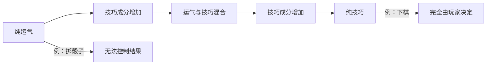
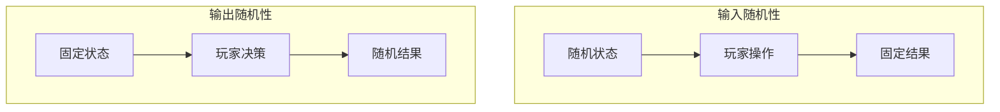
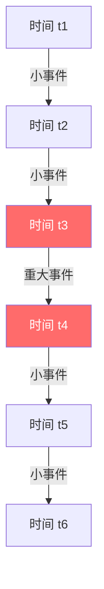

# 第06课：运气与技巧的平衡

## Learning Objectives

- 区分游戏设计中的**运气（Luck）**与**技巧（Skill）**，理解二者在玩家体验中的不同角色
- 掌握输入随机性与输出随机性的区别及其设计应用
- 理解损失厌恶、禀赋效应等心理学机制对玩家体验的影响
- 学会运用框架效应（Framing）来引导玩家的感知
- 掌握通过调节运气与技巧来平衡游戏难度的方法

## Core Idea

在游戏设计中，**运气（Luck）** 和 **技巧（Skill）** 并非对立的两极，而是构成一个连续的光谱。优秀的设计师需要理解如何在这条光谱上移动，以创造既公平又令人兴奋的体验。

**技巧** 是一种可通过练习获得和提升的能力，它属于玩家自身的属性。技巧通常是可以衡量的——谁更快、谁更精准、谁的成功率更高。技巧会随着时间的推移而变化，玩家会不断进步或退步。

**运气** 则通常表现为缺乏信息或控制力的情况。当玩家无法提前知道结果、缺乏足够的知识或技能去有意识地完成某事时，结果便由运气决定。

关键洞察在于：**增加运气元素并不意味着减少技巧元素，反之亦然。** 两者是独立的维度，设计师可以同时操控它们来创造丰富的游戏体验。



## Attribute vs Skill

**属性（Attribute）** 与 **技巧（Skill）** 有本质区别：

- **属性** 是持续存在的状态，如篮球运动员的身高、角色的基础力量值。属性可以通过时间投入来提升，但通常不依赖玩家的操作水平。
- **技巧** 是通过学习和经验获得的，如对地图的熟悉程度、连招的执行能力。

在游戏设计中，属性为不同水平的玩家提供了进展的缓冲，使休闲玩家也能感受到成长，而技巧则决定了高手之间的差距。

## 随机性的类型

### 输入随机性（Input Randomness）

游戏状态是随机的，但结果可由玩家操控。例如在集换式卡牌游戏中，你抽到的牌是随机的，但如何使用这些牌完全取决于你的技巧。大逃杀游戏中的武器拾取也属于这一类——你无法控制找到什么，但能否有效利用找到的工具则体现技巧。

### 输出随机性（Output Randomness）

游戏状态是固定的，但操作的结果是随机的。例如轮盘赌中，你可以选择下注的数字，但球最终落在哪里是随机的。游戏中的暴击几率也属于输出随机性——你可以围绕暴击构建角色，但无法控制每次攻击是否触发暴击。



## 噪声类型与游戏节奏

**白噪声（White Noise）**：完全的随机性，当前结果与之前结果无关。如轮盘赌的每次旋转。

**布朗噪声（Brown Noise）**：结果与当前状态相似，长期来看趋于随机。如射击游戏中武器的后坐力模式。

**粉红噪声（Pink Noise）**：大部分时间结果接近当前状态，但偶尔出现巨大变化。这是游戏中最理想的形式——既有可预测性，又有令人兴奋的波动。如《卡坦岛》中的骰子资源系统，大部分时间产出稳定资源，偶尔出现稀有数字改变游戏局势。



## 玩家心理学

### 损失厌恶（Loss Aversion）

失去某物的感受远比获得同等价值的感受更强烈。人们需要约2倍的潜在收益才会接受一个有50%概率损失10美元的赌注。

### 禀赋效应（Endowment Effect）

一旦你拥有某物，你对它的估值就会高于未曾拥有时。在《宝可梦》中，玩家对自己捕获并命名的宝可梦会产生额外的情感价值。

### 沉没成本效应（Sunk Cost Effect）

人们倾向于继续投入已经付出努力的事情，即使继续投入已无实际意义。这在游戏开发中表现为对耗时开发的功能难以割舍。

### 处置效应（Disposition Effect）

人们倾向于卖出已经升值的投资，而持有贬值的投资。在游戏中，这表现为玩家更愿意使用已被证明有效的策略，而非尝试新的可能更优的方案。

## Framing 框架效应

框架效应通过改变表述方式，在不改变实际意图的情况下影响人们的感知：

- **《魔兽世界》每日经验加成**：表面上给玩家经验加成，实际上调整了升级所需经验总量，限制了玩家过快地消费内容。
- **《彩虹六号：围攻》人质模式**：将玩家限制在特定区域防守，但"保护人质"的框架让这一限制感觉更有意义。
- **《黑暗之魂》死亡机制**：死亡后失去未使用的经验值，但可以通过回到死亡地点拾回。成功拾回相当于获得双倍经验，本质上是在帮助频繁死亡的玩家更快升级，却让玩家感觉受到了惩罚。

## Worked Example

### 《黑暗之魂》的死亡机制分析

```
死亡 → 失去未使用的魂（经验/货币）
     → 重生于最后休息点
     → 可返回死亡点拾回魂
          └→ 成功拾回 → 获得双倍经验（隐藏增益）
          └→ 再次死亡 → 永久失去所有魂（惩罚）
```

这个机制同时包含了多种心理元素：
1. **损失厌恶**：失去魂的感觉非常糟糕
2. **禀赋效应**：你曾经拥有这些魂，现在失去了
3. **沉没成本**：你必须投入更多时间来重新获得
4. **隐藏的橡皮筋机制**：频繁死亡的玩家通过"拾回"获得更多经验，实际上让游戏更容易

FromSoftware 的精妙之处在于，玩家感觉游戏非常难，但如果他们不断死亡，游戏实际上在不断为他们提供更多资源。

## Practice

> [!QUESTION] 自测练习
> 假设你正在设计一款大逃杀游戏，一名新手玩家抱怨"游戏全靠运气，我找到的武器总是比对手差"。请用本节课所学的概念分析：
> 1. 这属于输入随机性还是输出随机性？
> 2. 游戏的技巧性是否真的降低了？为什么？
> 3. 你会如何重新设计武器拾取系统，让新手感觉更公平，同时保留随机性的乐趣？
> 4. 运用框架效应，你能如何改变武器掉落机制的表述，让玩家感觉更好？

<details>
<summary>查看答案</summary>

1. 这属于**输入随机性**——玩家遇到的武器是随机的，但如何使用武器取决于技巧。

2. 游戏的技巧性**并没有降低**。事实上，随机武器要求玩家掌握多种武器的使用方式，增加了需要学习的技巧范围。高手玩家了解地图上哪些区域可能刷新特定武器，并能有目的地移动至这些区域，这本身就是一种技巧。

3. 可能的改进方案：
   - 添加武器熟练度系统，让玩家在使用某种武器时逐渐提升其性能
   - 保证每个刷新点至少提供"可用"级别的武器，而非让某些区域完全空手
   - 提供"武器交换"机制，允许玩家将不需要的武器转换为其他资源

4. 框架效应示例：
   - 不表述为"你将随机获得一把武器"，而是"你的适应能力决定了你能发挥武器的多少潜力"
   - 将武器稀有度命名为"需要练习"、"需要精通"、"需要大师级技巧"，强调技巧而非运气
</details>

## Next Step

恭喜你完成了第06课的学习！你已经掌握了运气与技巧的核心概念、随机性类型以及玩家心理学在游戏设计中的应用。接下来，请进入[第07课：游戏循环](./0007-game-loops.md)，学习如何通过循环结构来组织游戏体验。
