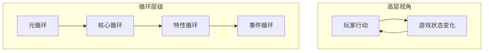
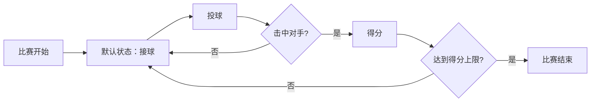
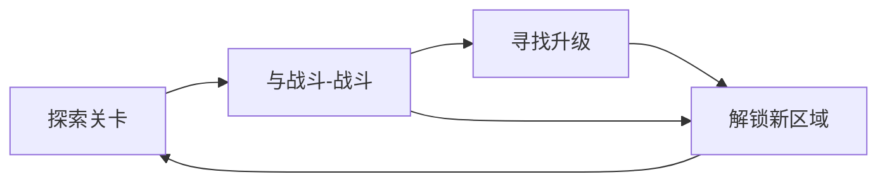
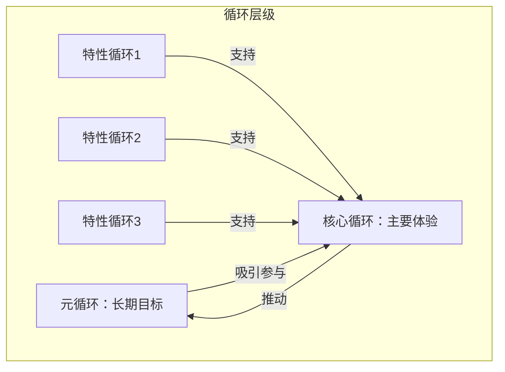

# 第07课：游戏循环

## Learning Objectives

- 理解**游戏循环（Game Loops）** 作为游戏设计结构框架的核心作用
- 区分**玩家互动循环（Player Interaction Loop）**、**核心循环（Core Loop）**、**特性循环（Feature Loop）** 和**元循环（Meta Loop）**
- 掌握游戏循环的语法元素：池、门、源、漏、汇
- 学会使用游戏循环作为设计团队之间的沟通工具
- 能够将复杂游戏拆解为可管理的小型循环组件

## Core Idea

**游戏循环（Game Loops）** 是游戏设计师用来评估、完善和可视化游戏结构的一系列特定步骤。循环帮助我们将产品划分为独立的游戏玩法部分，生成结构清晰的主题，每个主题都有明确的要求和目标。

游戏循环的核心价值在于：

1. **视觉化桥梁**：作为设计师与其他部门（特别是技术部门）之间的沟通工具
2. **结构化分析**：从宏观到微观分析游戏的每个组成部分
3. **平衡简化**：将固定数值与趋势机制结合，实现精细的游戏平衡
4. **优先级判断**：判断哪些功能对游戏核心体验至关重要



## 循环的语法元素

不同的工作室对循环的命名有所不同，但以下是通用的语法系统：

| 元素 | 形状 | 功能 |
|------|------|------|
| **池（Pool）** | 圆形 | 提供资源或定义产品状态，如房间、探索状态、硬币数量 |
| **门（Gate）** | 菱形 | 多个资源池之间的决策点，如"击中敌人了吗？" |
| **源（Source）** | 图标 | 创建新资源或作为起始点，如比赛开始、商店收入 |
| **漏（Drain）** | 图标 | 移除资源，如在商店花费金钱 |
| **汇（Sink）** | 方框 | 结束循环，如比赛结束、玩家生命值归零 |

## 循环的类型

### 玩家互动循环（Player Interaction Loop）

从玩家的纯粹视角看待游戏的整体玩法，完全忽略技术实现细节。这是最高层次的概述，帮助设计师理解"玩家到底在做什么"。



### 核心循环（Core Loop）

概述游戏的高层次体验，通常包含游戏中三到四个最重要的元素。核心循环展示了游戏的主要互动、互动的结果，以及反馈如何回到主要互动。

例如，一款Roguelike游戏的核心循环可能为：
```
探索关卡 → 与敌人战斗 → 获取升级 → 探索新区域
```

核心循环决定了哪些功能真正重要——如果一个功能不直接支持核心循环中的任何元素，可能不值得投入开发资源。



### 特性循环（Feature Loop）

详细解释单个功能的运作方式。特性循环通常分为两个视角：

- **玩家视角**：玩家对某物的**心理模型**、基于模型采取的**行动**、从游戏中接收的**反馈**
- **规则视角**：游戏系统实际评估的**规则集合**

```
心理模型 → 执行动作 → 规则评估 → 反馈 → 更新心理模型
```

特性循环对教程设计尤其重要。通过精心设计的反馈，玩家可以自然理解游戏机制，减少对显性教程的依赖。

### 元循环（Meta Loop）

描述玩家的长期动机，解释玩家为什么愿意回归游戏。元循环定义了玩家在体验核心循环过程中所追求的进展：

- 体验完整的故事
- 打败所有Boss
- 收集所有升级道具
- 探索所有区域
- 速通挑战

元循环是玩家持续游玩的动力源泉，也是许多游戏设计中经常被忽视的环节。

## 循环的相互影响

精心设计的游戏循环之间应当相互支持：

1. **特性循环**应当提升**核心循环**中的某个元素
2. **核心循环**应当推动**元循环**的进展
3. **元循环**应当吸引玩家参与**核心循环**

如果特性循环设计混乱，玩家会觉得游戏难以理解；如果核心循环设计不当，游戏会缺乏进展感；如果元循环缺失，玩家只会玩一两局就不再回来。



## Worked Example

### Rainbreaker 的游戏循环分析

这款Roguelike游戏的核心循环由以下元素构成：

| 核心元素 | 描述 | 支持的特性循环 |
|---------|------|--------------|
| 探索关卡 | 玩家在关卡中导航 | 战斗场景、Boss战、谜题、收集物品 |
| 战斗 | 与敌人对抗 | 伤害机制、生命值系统、陷阱互动 |
| 寻找升级 | 提升玩家能力 | 新武器、道具、属性提升 |
| 解锁新区域 | 推进游戏进程 | Boss击败机制、叙事解锁 |

## Practice

> [!QUESTION] 自测练习
> 选择你熟悉的一款游戏（如《塞尔达传说：旷野之息》、《我的世界》或《英雄联盟》），尝试分析：
> 1. 这款游戏的核心循环是什么？画出包含3-4个元素的循环图。
> 2. 列举至少两个支持核心循环的特性循环。
> 3. 这款游戏的元循环有哪些？至少列出两个游戏内设定的元目标和两个玩家自设的元目标。
> 4. 如果某个新功能不支持任何核心循环元素，你会如何决定是否实现它？

<details>
<summary>查看答案</summary>

以《塞尔达传说：旷野之息》为例：

1. **核心循环**：
   ```
   探索海拉鲁 → 解决谜题/战斗 → 获取装备/能力 → 挑战更强敌人/区域 → 探索新区域
   ```

2. **支持的特性循环**：
   - **战斗系统循环**：锁定敌人 → 选择武器 → 攻击/躲避 → 武器耐久度降低 → 武器损坏 → 寻找新武器
   - **烹饪系统循环**：收集材料 → 选择食谱 → 烹饪 → 获得增益效果 → 消耗效果 → 收集新材料

3. **元循环**：
   - 游戏设定的目标：击败灾厄盖侬、解放四神兽、完成所有神庙挑战
   - 玩家自设的目标：收集所有呀哈哈、拍摄所有图鉴条目、速通挑战

4. **功能决策**：如果一个功能不支持任何核心循环元素，除非它能解决特定的技术或体验问题（如加载优化、基础交互等），否则不应投入开发资源。团队应该优先考虑那些直接支持核心循环的功能，因为它们决定了游戏的核心体验。
</details>

## Next Step

恭喜你完成了第07课的学习！你已经掌握了游戏循环的概念、类型和语法，以及如何用循环来分析和设计游戏。接下来，请进入[第08课：反馈循环](./0008-feedback-loops.md)，学习如何通过反馈机制来调控游戏平衡。
