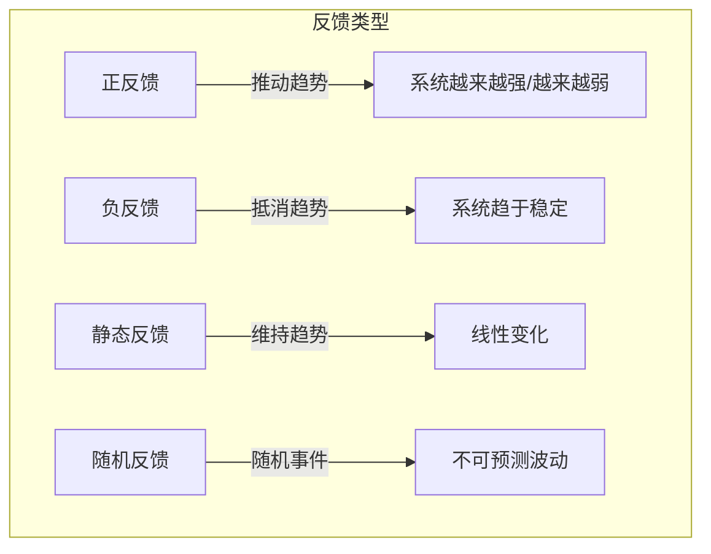
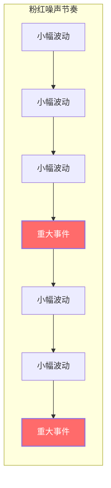

# 第08课：反馈循环

## Learning Objectives

- 理解**反馈循环（Feedback Loop）** 的基本定义及其在游戏平衡中的作用
- 区分**正反馈循环（Positive Feedback Loop）** 与**负反馈循环（Negative Feedback Loop）**
- 掌握**静态趋势（Static Trend）** 与**随机反馈（Random Feedback）** 的应用场景
- 学会使用反馈循环来设计自我平衡的游戏系统
- 了解斯金纳箱的机制及其在游戏设计中的应用与局限

## Core Idea

**反馈循环（Feedback Loop）** 是推动游戏状态朝期望方向发展的趋势机制。它让设计师能够创建自我平衡的系统，而不必为每个数值寻找完美的平衡点。

反馈循环的本质是：**系统根据当前状态对自身进行调整**。它分为几种基本类型，各自产生不同的游戏体验。



## 反馈循环的类型

### 正反馈循环（Positive Feedback Loop）

正反馈推动当前的趋势继续发展，通常导致系统不稳定。在游戏中，这表现为力量的持续增长：

- **《星际争霸》工人系统**：建造更多工人→收集更多矿物→建造更多工人→收集更多矿物
- **MOBA游戏的最后一击**：成功补刀→获得更多金币→购买更强装备→更容易补刀→获得更多金币
- **《使命召唤》连杀奖励**：击杀敌人→获得连杀奖励→更容易击杀更多敌人

正反馈循环创造了**力量幻想**，让玩家感受到越来越强大。但如果只使用正反馈，游戏最终会变得不可控或在某个点遇到瓶颈。


### 负反馈循环（Negative Feedback Loop）

负反馈的作用与正反馈相反——它会识别趋势并产生对抗措施，使系统趋于稳定：

- **《魔兽争霸3》维护费机制**：拥有过多单位→收入减少→限制单位膨胀→其他玩家有机会追赶
- **《马里奥赛车》橡皮筋机制**：领先→获得更差道具→被追赶；落后→获得更强道具→追赶

负反馈让游戏保持稳定性，适合希望维持竞技平衡的场景。它也能创造"派对游戏"的氛围，让不同技能水平的玩家能够一起享受游戏。


### 静态趋势（Static Trend）

静态趋势仅仅维持当前的变化方向，不做任何增强或削弱。它是一条线性的发展曲线，常见于基础资源生成系统。

### 随机反馈（Random Feedback）

随机反馈生成与当前趋势无关的波动。其中最具游戏价值的是**粉红噪声（Pink Noise）** 模式：

```
小事件 → 小事件 → 小事件 → 重大事件 → 小事件 → 小事件 → 重大事件 → ...
```

粉红噪声在竞技游戏中效果尤为出色——大部分时间保持可预测性，偶尔的突发事件迫使玩家重新评估局势，创造令人兴奋的游戏时刻。



## 平衡策略的三种方法

| 方法 | 描述 | 示例 |
|------|------|------|
| **特性导向平衡** | 增加新特性或修改现有特性解决问题 | 在找不到城镇的位置增加高塔作为地标 |
| **数值/美学平衡** | 调整数值如生命值、伤害、速度 | 敌人伤害太高→降低伤害值 |
| **基于反馈的平衡** | 系统根据自身状态自动调整 | 玩家单位太多→收入减少 |

## 斯金纳箱（Skinner Box）

斯金纳箱是游戏设计中常被引用的概念，它描述了操作性条件反射的基本原理：

- **固定奖励**：每次操作都获得奖励 → 形成基本操作习惯
- **可变奖励**：随机获得奖励 → 操作频率显著增加，行为更持久

这在游戏中体现为每日奖励、战利品箱等系统。然而需要警惕的是：

1. **参与度不等于喜爱度**：玩家频繁操作不代表他们喜欢你的游戏
2. **惩罚机制复杂**：引入惩罚会显著改变玩家行为，可能引发逃避行为
3. **奖励需匹配投入**：如果努力与回报不匹配，系统会失效
4. **研究局限性**：斯金纳箱的动物实验不能完全解释人类的复杂动机

## Worked Example

### 《大富翁》中的正反馈循环

```
经过起点 → 获得200元 → 购买房产 → 收取租金
                                       ↓
                              收入增加 → 购买更多房产
                                       ↓
                              租金进一步增加
```

在这个循环中：
- 玩家拥有的房产越多，租金收入越高
- 收入越高，能购买的房产越多
- 这导致领先者越来越领先，形成典型的正反馈循环

游戏中的负反馈元素：
- 对手也需要支付租金给领先者
- 拍卖机制让落后玩家有机会低价获得房产
- 机会卡和公益金卡提供随机波动

## Practice

> [!QUESTION] 自测练习
> 你正在设计一款多人对战射击游戏，测试发现：高水平玩家总是碾压初学者，导致新手在游戏前5分钟就退出游戏。
> 1. 分析目前游戏中存在的是正反馈还是负反馈？为什么？
> 2. 请设计一个负反馈机制来解决这个问题。
> 3. 如何利用粉红噪声让游戏对新手更有趣？
> 4. 你需要在游戏中加入"力量成长"的乐趣（正反馈）和"公平竞技"的平衡（负反馈），如何平衡二者？

<details>
<summary>查看答案</summary>

1. 当前存在**正反馈循环**：高水平玩家→获得更多击杀→获得更强武器/装备→更容易击杀→进一步扩大优势。这导致强者愈强，弱者愈弱，形成"雪球效应"。

2. 负反馈机制示例：
   - **动态伤害调整**：连续击杀对手后，武器伤害逐渐降低
   - **重生保护**：被击杀的玩家重生后获得短暂护盾或伤害加成
   - **弱势方增益**：队伍整体得分较低时，获得移动速度或武器补给加成
   - **地图暴露**：领先玩家的位置会间歇性地暴露给所有对手

3. 粉红噪声的应用：
   - 引入"突发事件"事件，如随机空投补给（强力武器），让落后玩家有机会获得翻盘工具
   - 地图上周期性出现特殊目标，改变常规对抗节奏
   - "风暴"或"区域封锁"事件迫使玩家重新定位，打破现有优势格局

4. 平衡策略：
   - **阶段性设计**：前期（正反馈为主，让玩家感受成长）→ 中期（引入负反馈，防止优势过大）→ 后期（随机反馈增加变数）
   - **分层系统**：基础战斗采用负反馈保持公平，而"终极技能"或"大招"系统采用正反馈提供爽快感
   - **资源分离**：将"击杀奖励"与"经济资源"分开，击杀提供短时优势（正反馈），经济系统通过负反馈平衡长线资源
</details>

## Next Step

恭喜你完成了第08课的学习！你已经掌握了反馈循环的核心概念，能够区分正负反馈并运用它们来平衡游戏。接下来，请进入[第09课：心流空间](./0009-flow-space.md)，学习如何为玩家创造沉浸式的心流体验。
