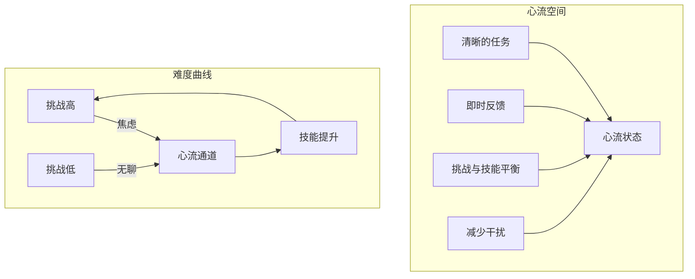
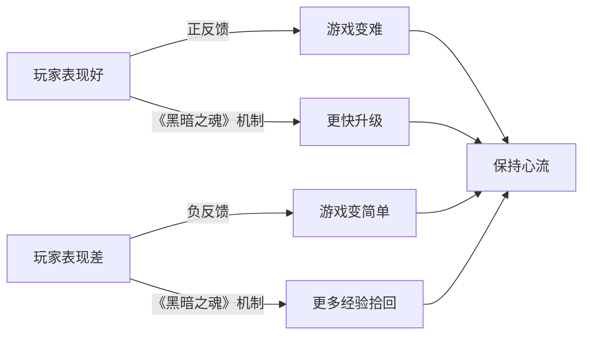

# 第09课：心流空间

## Learning Objectives

- 理解**心流（Flow）** 状态的定义及其在游戏体验中的核心地位
- 掌握**心流空间（Flow Space）** 的四个关键要素：清晰目标、即时反馈、挑战与技能的平衡、减少干扰
- 学习如何通过难度曲线设计来维持玩家的心流状态
- 理解**简单性（Simplicity）** 对进入心流状态的重要性
- 掌握用户界面设计对心流体验的影响

## Core Idea

**心流（Flow）** 是一种人们达到挑战与技能完美平衡时的状态。在这个状态中，你没有意识到自己在行动——你只是自然而然地执行。这是大多数人在游戏中追求的理想体验。

然而，传统的心流理论只关注了"平衡"这一个维度。**心流空间（Flow Space）** 是一个扩展概念，它定义了进入心流状态所需要的多个方面：

1. **清晰的任务（Clear Goals）**
2. **即时反馈（Immediate Feedback）**
3. **挑战与技能的平衡（Balance of Challenge and Skill）**
4. **减少干扰（Minimal Distractions）**



## 心流状态的要素

### 清晰的任务

玩家必须时刻清楚自己在做什么。任务分为三个层次：

| 层次 | 描述 | 示例 |
|------|------|------|
| **总体目标** | 游戏的终极目标 | 打败库巴、救出公主 |
| **当前目标** | 正在进行的任务 | 到达关卡的尽头 |
| **子目标** | 即时的行动任务 | 完成下一个跳跃、击败下一个敌人 |

玩家需要在不同层次之间切换意识，而不必时刻想着总体目标。但每个层次的目标都必须是清晰的、可理解的。

### 即时反馈

玩家应当始终了解每项行动的结果。反馈的优先级应当分层：

```
高声量反馈（生命值低、受到攻击）
    → 中等反馈（敌人出现在附近）
        → 低反馈（远处有可收集物品）
```

反馈应当**立即**发生（通常在0.3秒内），并且应当明确区分好坏（如红色代表坏事、绿色代表好事）。如果玩家没有注意到或理解反馈，它就等于不存在。

### 挑战与技能的平衡

游戏的难度必须与玩家当前的技能水平相匹配。由于玩家在游戏过程中会不断进步，难度曲线也必须动态调整。

调整难度的方法：

1. **等级/成长机制**：玩家可选择在简单区域停留更久，变得更强大后再前往困难区域
2. **匹配系统**：将技能相近的玩家匹配在一起
3. **橡皮筋机制**：表现越好，游戏越难；表现越差，游戏越简单

以《黑暗之魂》为例，其死亡机制巧妙地实现了动态难度：频繁死亡的玩家通过"拾回经验"机制获得双倍经验，实际降低了游戏难度，却让玩家感觉游戏"惩罚"了他们的失误。



### 减少干扰

确保玩家能够专注于当前相关的事物。干扰分为两类：

- **游戏内干扰**：不必要的弹窗、不相关的任务提示、过度的视觉效果
- **游戏外干扰**：玩家环境中的光线、噪音等不可控因素

设计的核心原则：**只保留玩家此刻所需的干扰信息**，让重要内容优先于不重要的内容。

## 简单性（Simplicity）

简单性是增强心流系统的重要元素，包含四个基本要素：

### 核心（Core）

产品的基本体验。理想情况下，只包含"玩或享受产品所需的功能"，不多不少。精简核心让游戏更优雅，更容易进入心流状态。

### 有限选择（Limited Choices）

玩家当前可用的所有选项。人类同时处理超过三个选择就会感到困难。设计师应：
- 将选择分组为三类（如战斗、防御、实用）
- 采用分层结构呈现复杂选择
- 避免一次性给出10个能力让玩家选择

### 直观性（Intuitive）

利用用户已有的知识来降低学习成本。经典的角色类型（法师、战士、盗贼）之所以有效，是因为玩家已经预知了它们的特性。**创造新事物是好的，但不需要一次性创造全部新事物**。

### 用户视角（User Perspective）

从用户的视角理解产品并预测交互方式：
1. 第一印象：这是什么？
2. 猜测功能：我如何与之交互？
3. 验证假设：它是否如我预期的那样工作？
4. 探索极限：我能否以其他方式使用它？

## UI设计对心流的影响

用户界面是进入心流状态的重要影响因素：

- **信息聚合**：将相关信息放在同一视野区域，减少玩家的视线移动
- **优先级差异化**：重要信息（生命值）应比次要信息（连击计数）更突出
- **空间对比**：玩家信息与敌人信息放置在不同侧，形成自然的视觉对比
- **避免信息过载**：隐藏当前不相关的UI元素

好的UI设计让玩家可以"不假思索"地获取所需信息，从而保持心流状态。

## Worked Example

### 分析一款游戏的UI对心流的影响

选择一款你熟悉的游戏，截取其游戏中的HUD界面，然后分析：

1. **信息分组**：哪些信息被放在一起？为什么？
2. **优先级**：最重要的信息是否最突出？
3. **干扰元素**：是否存在当前不需要的UI元素？
4. **反馈清晰度**：玩家的行动是否获得了即时、明确的反馈？

### 示例：《街头霸王》HUD分析

- 生命值条在屏幕顶部——始终可见，无需移动视线
- 能量/格斗计量器与生命值条相邻——所有关键信息在同一区域
- 连击计数较小，放在次要位置——有用但不关键
- 时间显示在中间——双方都能轻松看到

## Practice

> [!QUESTION] 自测练习
> 假设你正在设计一款开放世界动作RPG游戏的HUD，请回答以下问题：
> 1. 列出你认为对心流体验最重要的5条信息，并按优先级排序。
> 2. 你会如何将这些信息分组放置？请描述布局方案。
> 3. 游戏中可能有哪些分散玩家注意力的设计？你会如何解决？
> 4. 当玩家生命值较低时，你如何在不破坏心流的前提下提醒玩家？

<details>
<summary>查看答案</summary>

1. 优先级排序：
   - 玩家生命值（最高优先级，直接关联游戏继续）
   - 当前任务方向/目标标记
   - 当前武器/技能信息
   - 弹药/资源数量
   - 小地图/周围环境

2. 布局方案：
   - 屏幕左下角：玩家状态区域（生命值、能量值、状态效果）——便于在移动中快速余光查看
   - 屏幕右上角：小地图/方向指引——符合阅读习惯
   - 屏幕右下角：武器/技能信息——右手操作时可快速参考
   - 屏幕中央（仅在必要时显示）：任务目标、关键提示

3. 常见干扰及解决方案：
   - 弹出式成就提示 → 移至非战斗区域显示
   - 不必要的HUD元素 → 提供HUD自定义选项，让玩家隐藏次要信息
   - 过度闪光的特效 → 仅对关键交互元素使用高亮
   - 难以阅读的文字 → 使用图标替代文字，确保可读性

4. 低生命值提醒方案：
   - 视觉：屏幕边缘出现红色闪烁（不遮挡中心视野）
   - 听觉：低沉的规律心跳声或紧张氛围音
   - 触觉：手柄震动（如支持）
   - 持续但不刺耳：避免使用全屏闪烁或刺耳警报声
   - 重要的是：玩家能感知到威胁，但不被警报本身分散注意力

这些设计共同确保玩家能在紧张的战斗中保持心流状态，而不是被UI交互打断体验。
</details>

## Next Step

恭喜你完成了第09课的学习！你已经理解了心流空间的四个要素和简单性原则，掌握了如何通过设计引导玩家进入心流状态。接下来，请进入[第10课：设计思维过程](./0010-design-thinking-process.md)，学习系统化的游戏设计方法论。
