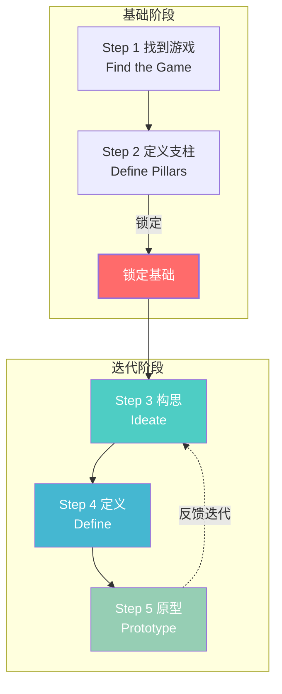
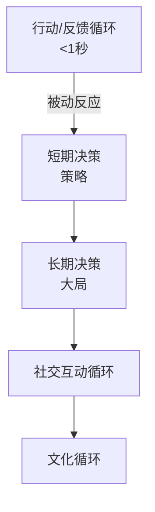

# 第10课：设计思维过程

## Learning Objectives

- 掌握**游戏设计思维过程（Game Design Thinking Process）** 的五个核心阶段
- 理解如何通过**概念文档（Concept Document）** 和**支柱文档（Pillars Document）** 确定游戏方向
- 学习**SCAMPER**头脑风暴技术及其在构思中的应用
- 理解玩家决策的不同层次与时间维度
- 掌握**自我决定理论（Self-Determination Theory）** 及其对玩家动力的影响
- 学会使用**三顶帽子技术（Three Hats Technique）** 分析游戏

## Core Idea

**游戏设计思维过程（Game Design Thinking Process）** 是一套方法论，它将游戏设计划分为多个迭代步骤，能够应用于从小型独立游戏到大型AAA游戏的所有开发环境。

该过程包含两个阶段和五个步骤：

**重要原则**：前两步（找到游戏和定义支柱）是游戏的基础，一旦锁定，除非极端情况，不应在开发过程中改变。后三步（构思、定义、原型）则是迭代循环，可反复进行。

## 第一阶段：找到游戏（Find the Game）

找到游戏意味着明确"你想制作什么样的游戏"以及"你想提供什么样的体验"。这是最关键也最困难的一步。

寻找游戏方向的方法：
- 关注童年经历或个人热情
- 发现市场中未被充分开发的类型
- 来自发行商的直接需求
- 结合对游戏、其他媒体以及现实世界的深刻理解

输出文档：**概念文档（Concept Document）**，约10页的游戏定义，提供高层次的总体视图。

## 第二阶段：定义支柱（Define Pillars）

**支柱（Pillars）** 是设定团队期望和设计指导方针的规则。通常是3-5条，每一条都应有清晰的描述：

- 支柱太少（<3）：可能导致范围蔓延，不断添加新功能
- 支柱太多（>14）：限制创造力和探索，且容易产生矛盾

定义支柱的方法：与团队一起审阅概念文档，找出"不可谈判的关键方面"——那些如果缺失游戏就不成立的核心要素。

示例：如果是一款强调角色自定义的RPG，"深度角色创建器"可能是支柱之一。

## 第三阶段：构思（Ideate）

使用概念和支柱作为约束来构思新功能。这个阶段的核心是生成尽可能多的创意，而不是评判它们。

### SCAMPER 技术

| 字母 | 含义 | 游戏示例 |
|------|------|---------|
| **S** | Substitute（替代） | 用其他机制替代现有系统 |
| **C** | Combine（组合） | 将关卡剩余时间转换为金币 |
| **A** | Adapt（调整） | 调整现有系统以适应新情境 |
| **M** | Modify（修改） | 修改攻击机制使其能摧毁地形 |
| **P** | Put to other use（另作他用） | 用硬币开设市场而非自动加命 |
| **E** | Eliminate（消除） | 移除硬币系统，改为积分奖励 |
| **R** | Reverse（逆向） | 反转胜利条件或常规玩法 |

### 有效头脑风暴的原则

1. 所有参与者必须清楚要解决的问题和背景约束（支柱、类型等）
2. 设定时间限制：2-3个时段，每个15-45分钟
3. 不打断正在发言的人
4. 不使用否定语言（"我们做不到"等）
5. 使用"是的，而且..."方法鼓励联想
6. 鼓励古怪和奇怪的想法——它们可能打开思维

### 头脑写作（Brainwriting）

参与者不发言，而是用便签纸默默写下想法并贴在墙上。这比传统头脑风暴更适合远程工作，也为内向的团队成员提供了表达机会。

## 第四阶段：定义（Define）

将一个想法精炼为可执行的方案。包含两个同时进行的子步骤：

1. **完善想法（Refine the Idea）**：找出玩家可能遇到的痛点和实现时可能遇到的问题
2. **编写功能（Write the Feature）**：撰写GDD章节或子章节，详细说明功能

定义阶段的输出是一份功能规范，具备足够的细节供团队其他成员实现。

## 第五阶段：原型（Prototype）

将定义好的功能实现为可玩的原型，然后进行测试。设计师需要：

1. 等待实现完成（或同时开发其他功能）
2. 尽可能多地使用功能，检测不一致之处
3. 对比"预期"与"实际表现"
4. 如果假设不正确，回到构思阶段重新迭代

## 玩家决策分析

### 决策的两种系统

根据丹尼尔·卡尼曼的理论，人类有两个决策系统：

| 系统 | 特点 | 游戏中的应用 |
|------|------|-------------|
| **自动系统（System 1）** | 快速、被动、几乎不费力 | 格斗游戏连招、FPS反应射击 |
| **理性系统（System 2）** | 缓慢、理性、需要脑力，但"懒惰" | 策略游戏决策、资源分配 |

大多数时候，理性系统会把决策责任推给自动系统。玩家在"有限理性"下做决策——他们假设自己掌握了所有必要信息，实际上并非如此。

### 决策的时间层次（互动循环）

1. **行动/反馈循环（Action/Feedback Loop）**：<1秒，被动反应。如《堡垒之夜》的小规模冲突。
2. **短期决策（Short-term Decisions）**：结合自动与理性系统，如拾取对手掉落的武器。
3. **长期决策（Long-term Decisions）**：高认知负荷，几乎只使用理性系统。如决定跳伞地点。
4. **社交互动循环**：考虑游戏中的社会情境和情感。
5. **文化循环**：将游戏视为文化活动，思考其对社会的影响。

### 糟糕的决策设计

| 类型 | 描述 | 示例 |
|------|------|------|
| **盲目决策（Blind Decision）** | 玩家没有信息，所有选择一样糟糕 | 赌场老虎机 |
| **明显决策（Obvious Decision）** | 只有一个合理选项 | 攻击+10 vs 攻击+11 |
| **无意义决策（Meaningless Decision）** | 结果无实际变化或未传达给玩家 | 分支叙事但玩家毫无影响 |

### 有趣的决策策略

1. **权衡（Trade-offs）**：每个选择都有优缺点。如法师高攻击但不能穿重甲。
2. **风险回报（Risk/Reward）**：短期高风险换取长期高回报，如RTS中的"rush"战术。
3. **读心（Yomi）**：猜测对手的想法并反向操作。如《魔兽争霸3》中侦察对手基地确定策略。
4. **规划（Planning）**：提供足够信息让玩家制定长期计划。

## 自我决定理论（Self-Determination Theory）

该理论关注动力的三个核心组成部分：

| 要素 | 含义 | 设计示例 |
|------|------|---------|
| **自主性（Autonomy）** | 玩家感觉能控制自己的行为和目标 | 开放世界、自由任务管理 |
| **能力（Competence）** | 玩家获得掌握感和挑战感 | 《火箭联盟》的逐步精通曲线 |
| **关联性（Relatedness）** | 在游戏中体验社群感 | 公会系统、Discord社群、卡片交换 |

最受欢迎的游戏类型（如开放世界MMORPG）通常在这三个维度上都表现出色。

## 三顶帽子技术（Three Hats Technique）

用于从不同视角分析游戏：

1. **信息帽（Information Hat）**：停下来分析"达到这一点需要什么信息？玩家如何获得这些信息？"
   - 适合分析教程设计
   - 例如：2D平台游戏中，小玩家不会移动——原来缺少"移动键"的教程

2. **分析帽（Analysis Hat）**：录制屏幕并做笔记。有了特定分析目标时最有效。
   - 例如：分析《Celeste》如何让跳跃手感如此令人满意

3. **情绪帽（Emotion Hat）**：记录游戏前、中、后的情绪变化。
   - 关注三个核心情绪：乐趣（Fun）、参与感（Engagement）、意义（Meaning）
   - 利用游戏中的低动作点（如关卡之间）记录情绪

## Worked Example

### 应用设计思维过程开发一款游戏

假设我们要开发一款心理健康主题的未来体育游戏：

**1. 找到游戏**
- 概念：无重力躲避球团队运动《Counterball》
- 目标受众：12岁以上玩家
- 核心体验：团队合作、弹跳球物理、角色自定义

**2. 定义支柱**
- 团队合作是胜利的关键
- 物理驱动的弹跳系统
- 丰富的角色个性化定制
- 公平竞争的快节奏对战

**3. 构思（使用SCAMPER）**
- 替代：用弹跳物理替代传统的线性投掷
- 组合：将"球弹跳"与"区域得分"机制结合
- 修改：球每弹跳一次加速，增加策略深度
- 消除：消除重力，创造零重力环境

**4. 定义**
详细设计接球机制：
- 心理模型：玩家认为球在接触角色范围内可被接住
- 规则：球的碰撞框与角色的抓取框重叠时触发接球
- 反馈：成功接球有声音+视觉特效

**5. 原型**
实现核心投球-接球-得分循环，测试基础体验是否有趣。

## Practice

> [!QUESTION] 自测练习
> 选择一款你熟悉的游戏或构思一个全新游戏概念，使用设计思维过程进行完整分析：
> 1. 写出你的游戏概念文档的核心内容（一句话简介、目标受众、核心体验）。
> 2. 定义3条游戏支柱，并写出每条支柱的描述。
> 3. 使用SCAMPER技术中的至少3个策略，对游戏中的一个现有机制进行改进。
> 4. 运用三顶帽子技术分析一个你最近通关的游戏关卡：分别从信息帽、分析帽和情绪帽的角度写出你的发现。

查看答案

以《塞尔达传说：旷野之息》的神庙解谜为例：

**1. 概念文档（精简版）**
- 一句话简介：探索广袤海拉鲁，通过解谜和战斗拯救世界
- 目标受众：12岁以上，喜欢探索和解谜的玩家
- 核心体验：自由探索、物理驱动的解谜、沉浸式世界

**2. 游戏支柱**
- 开放世界的自由探索——玩家可以前往任何可见的地方，世界不会设置看不见的墙壁
- 物理与化学引擎驱动的交互——所有解谜和战斗都基于可预测的物理规则
- 玩家的创造力是解决问题的最佳工具——每个问题都有多种解法

**3. SCAMPER分析神庙解谜**
- **组合（Combine）**：将磁铁能力和金属物体组合，创造复杂的移动路径
- **修改（Modify）**：修改常规的时间静止能力，使其可以存储动能后释放
- **逆向（Reverse）**：逆向思考常规解法——不是避开守卫，而是利用守卫激活机关

**4. 三顶帽子分析**
- **信息帽**：玩家需要理解"希卡石板"的四种能力（磁铁、炸弹、冰柱、时间静止），这些通过初始神庙教学获得。如果玩家错过了教学，后续解谜会非常困难。
- **分析帽**：游戏通过"初始台地"作为教学区域，逐步引导玩家掌握核心能力。每个能力都在后续神庙中被反复测试和组合使用，形成螺旋上升的难度曲线。
- **情绪帽**：初入游戏时感到渺小和好奇；完成第一个神庙时获得成就感；发现多种解法时感到惊喜和聪明；游戏过程中持续的"想再探索一个区域"的冲动。

## Next Step

恭喜你完成了第10课的学习！你已掌握了设计思维过程的五个核心阶段，学会了SCAMPER技术、决策分析、自我决定理论和三顶帽子分析方法。至此，本模块的所有课程已全部完成。这是一个里程碑式的进展——你已经掌握了游戏设计的基础理论框架，可以开始将这些知识应用到实际游戏设计工作中了。
