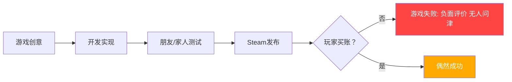

# 第11课：游戏为什么失败

## Learning Objectives

- 理解传统游戏设计的根本缺陷——设计师为"自己"而非为玩家创作
- 识别游戏失败的真正原因：玩家从未被纳入设计过程
- 掌握 **Player-Centered Game Design (PCGD)** 的基本理念及其三个关键要素
- 对比传统线性开发与PCGD迭代循环的差异

## Core Idea

大多数游戏失败不是因为bug太多或玩法太简单，而是因为游戏不尊重最重要的那个人——实际的玩家。课程讲师杨娜-蒂尼博士 (Dr. Jana Tini) 指出，她的研究背景横跨严肃游戏奖励机制与人机交互，她创办 **IndieUXR** 的初衷就是将研究驱动的以玩家为中心的设计引入独立游戏社区。

传统开发模式下，设计师凭直觉和周围小圈子的反馈构建游戏，最终产品与真实玩家的需求之间存在巨大鸿沟。朋友和同事会说"画面真漂亮"、"机制真有创意"，但这些评价来自**非目标用户**——他们和实际付费玩家对游戏的期望截然不同。

这个流程图展示了传统游戏设计的"线性赌博"模式——直到发布那一刻，设计师才知道玩家是否买账。与之相反，**PCGD** 将玩家从终点站拉回到创作过程的起点，在整个开发周期中持续与玩家协作。

> [!TIP] Key Insight
> 游戏失败不是因为做得不够好，而是因为没有问对的人。**PCGD** 不是一套死板的方法，而是一种将玩家视为共同创作者的思维方式——"与玩家一起设计 (design **with** players)，而不是为玩家设计 (design **for** players)"。课程所依据的同名书籍《以玩家为中心的游戏设计》深入阐述了这一整套方法论与心态。

## PCGD的影响范围

**PCGD** 不是只在某个环节生效的修补工具，它会影响游戏体验的**每一个方面**：

- **视觉与声音一致性**：玩家会第一时间反馈"这个动画感觉不对"、"这里需要音效"、"这些颜色让我看不清楚"
- **可用性与无障碍性**：通过早期测试确保没有笨拙的菜单、不清晰的教程、不直观的按键映射
- **情感投入**：当玩家感到被倾听时，他们会更愿意投入时间、回归游戏、邀请朋友加入
- **核心系统设计**：从商店里治疗药水的价格到奖励放置的逻辑，每一个设计决策都应基于玩家反馈

这正是课程讲师通过多年研究和实践总结出的核心理念——**PCGD** 改变的不仅是你制作游戏的方式，更是玩家对你游戏的感知方式。

## 传统设计的三大陷阱

1. **自我投射陷阱**：设计师默认"我觉得有趣的玩法，玩家一定也觉得有趣"，忽略了自身与目标玩家在技能水平、游戏偏好上的巨大差异
2. **小圈子回声室**：团队内部和朋友的正面反馈形成信息茧房，掩盖了设计中的根本问题
3. **发布即赌博**：所有决策在发布前从未经过真实用户验证，成败取决于运气而非系统化的设计过程

## Worked Example

假设你是一位鞋匠，自认为做出了全世界最好的鞋子。你给父母看，他们为你骄傲；你给朋友看，他们都惊叹不已。你自己穿上也很合脚。但当鞋子摆上货架，顾客却问："为什么鞋跟在这里？为什么尺码小了十个号？"

这正是游戏开发者常犯的错误：团队内部觉得一切完美，但真正的玩家根本不买账。**PCGD** 颠覆了这一局面——在蓝图阶段就邀请顾客来试穿、提意见，确保产品从一开始就是他们想要的。

再举一个实际游戏场景：你带着一个精心打磨的demo参加游戏展会，旁观的玩家玩了5分钟就放下手柄离开，没有任何解释。这不是因为游戏有bug，而是因为玩家的**心理预期**与游戏的实际体验之间存在断层——他们没有参与设计过程，所以游戏并没有满足他们的期待。

## Practice

> [!QUESTION] Self-check
> 传统游戏设计流程与以玩家为中心的设计流程最本质的区别是什么？为什么朋友和同事的测试不能替代真实玩家的测试？

Reveal answer

传统流程是线性的：创意 -> 开发 -> 可选测试 -> 发布。设计师在"真空"中做所有决策，玩家只出现在最终销售环节。**PCGD** 则是**迭代循环**：计划 -> 理解上下文 -> 确定需求 -> 原型 -> 玩家评估 -> 分析迭代 -> 重新计划。玩家从第一天起就参与其中，设计决策基于真实反馈而非猜测。

朋友和同事不能替代真实玩家的原因是：他们和你属于同一个社交圈，有着相似的背景和游戏偏好；他们出于情感关系会给出偏向性的正面反馈；他们不是你的**目标用户**——那些会在Steam上掏钱购买并实际花时间体验你游戏的陌生人。真正的玩家没有"照顾你感受"的义务，他们的反馈才是市场真实需求的反映。

## Next Step

从这一课我们已经看到传统模式为何失败。接下来让我们深入理解 **PCGD** 的核心定义与设计循环。继续学习 [[0102-pcgd-intro|第12课：以玩家为中心的设计理念]]。