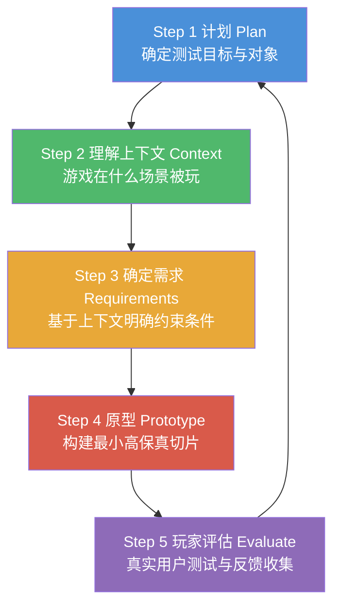

# 第12课：以玩家为中心的设计理念

## Learning Objectives

- 掌握 **PCGD (Player-Centered Game Design)** 的三大关键要素
- 理解"与玩家共同设计"比"为玩家设计"的根本区别
- 熟悉 **PCGD** 迭代循环的五个步骤及其运作方式
- 认识PCGD在降低成本、提升可用性和玩家参与度方面的实际收益

## Core Idea

**PCGD** 的核心一句话可以概括为：与玩家共同设计 (design **with** players)，而不是为玩家设计 (design **for** players)。它不是一套僵化的流程，而是一种将玩家纳入创作核心的思维方式。它有三个关键要素：

1. **真实的玩家，而非猜测**——用实际用户反馈替代设计团队的假设
2. **及时且频繁的反馈与合作**——在开发的每一个阶段持续引入玩家视角
3. **自下而上的设计驱动**——不从团队顶层意志出发，而是从玩家的真实体验出发

这五个步骤构成一个**迭代闭环**：每一步的输出都驱动下一轮计划。不是一次性的线性流程，而是持续循环直到游戏达到玩家期望的质量。注意，**PCGD** 并没有唯一的"标准流程"——不同工作室、不同项目可以灵活调整，但核心理念不变：始终将玩家置于设计决策的核心。

> [!TIP] Key Insight
> **PCGD** 的威力不在于某个特定方法，而在于"早测试、频测试、快迭代"的心态。越早让玩家介入，修复成本越低——就像在蓝图上挪一堵墙远比房子建好后拆墙便宜得多。这直接转化为更低的开发成本、更好的可用性和更高的玩家参与度。

## PCGD的关键收益

- **降低开发成本**：早期发现的设计问题修改成本极低，后期发现问题则需要"大锤"处理
- **更好的可用性**：玩家参与测试可以提前发现笨拙的菜单、不清晰的教程、不直观的按键映射
- **更高的玩家投入度**：参与设计过程的玩家会感觉到被倾听，从而建立更强的情感连接和社区归属感
- **视觉与声音一致性**：玩家能第一时间反馈"这个动画感觉不对"、"这里需要音效"、"这些颜色不够清晰"

## Worked Example

以设计一个移动端解谜游戏为例，展示五个步骤的完整应用：

1. **计划**：确定要测试当前关卡的特定谜题机制，招募30名目标玩家（年龄22-35岁、喜欢解谜类游戏）
2. **理解上下文**：通过访谈发现目标玩家主要在**通勤路上**玩游戏，每次游戏时长2-5分钟，经常被打断
3. **确定需求**：谜题必须支持随时暂停/继续、单个谜题不超过3分钟完成、字体在户外阳光下可读
4. **原型**：用纸笔和简单的数字工具制作谜题原型，只搭建这一关的核心交互，不包含任何美术资源
5. **玩家评估**：在玩家的日常通勤环境中进行测试，观察他们是否能在不阅读任何说明的情况下完成谜题，记录他们困惑的表情和操作犹豫点

收集反馈后回到第一步：玩家普遍反映"不知道哪个方块可以拖动"——这表明需要增加**可供性 (affordance)** 提示，例如可拖动方块在触摸时产生微弱震动。

## Practice

> [!QUESTION] Self-check
> PCGD 为什么说"降低开发成本"？这和建房子有什么类比关系？为什么"让玩家参与测试"和"让所有人参与测试"不是一回事？

Reveal answer

在蓝图上修改一堵墙的位置只需要划掉一条线、在别处画一条线——几乎零成本。但墙已经砌好之后再拆掉重砌，需要大锤、新砖、人工，还会延误工期。**PCGD** 在早期（蓝图阶段）就通过玩家反馈发现问题，避免了后期（房子建好后）的昂贵返工。

"让玩家参与测试"不是随便找任何人测试。你的奶奶、你的同事、游戏团队的其他成员都不是合适的测试对象。真正的测试对象必须是**目标用户**——那些会为你的游戏付费、花时间游玩的真实玩家。他们的反馈才代表市场的真实声音。

## Next Step

现在我们已经理解 **PCGD** 的理念和循环，接下来看看如何运用设计心理学工具让玩家的交互变得直观。继续学习 [[0103-affordances-constraints|第13课：可供性与约束]]。
