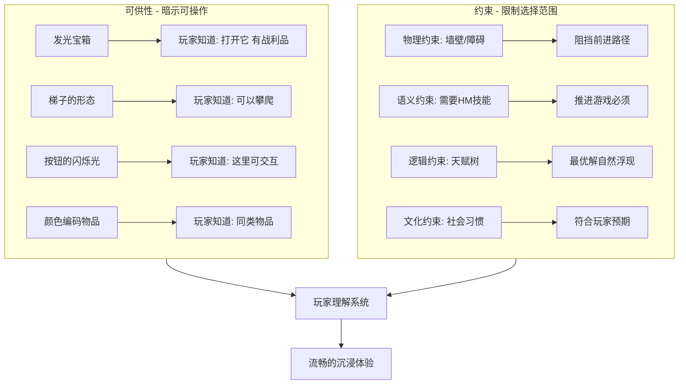

# 第13课：可供性与约束

## Learning Objectives

- 理解 **Affordance (可供性)** 如何通过视觉和交互线索告诉玩家"可以做什么"
- 掌握 **Constraint (约束)** 的四种类型及其对玩家体验的引导作用
- 学会运用 **Mapping (映射)** 原则设计直观的控制方案
- 理解 **Signifier (标识符)** 在引导玩家注意力中的关键作用

## Core Idea

**Affordance** 和 **Constraint** 来自唐-诺曼 (Don Norman) 的《日常事物的设计》，在以玩家为中心的游戏设计中，它们是让玩家"无师自通"的两大核心工具。**Affordance** 告诉玩家"你可以和这个对象交互"，**Constraint** 则告诉玩家"你不应该做什么"或"你只能做什么"，两者共同降低认知负担、减少挫败感。第三大工具 **Mapping (映射)** 则确保玩家的操作输入与游戏中的动作输出之间有自然、一致的关系。

> [!TIP] Key Insight
> 好的 **Affordance** 让玩家直觉地知道该做什么；好的 **Constraint** 防止玩家做出破坏体验的选择；好的 **Mapping** 让操作与结果之间的关联毫不费力。三者的平衡决定了游戏"上手是否友好"。标识符 (signifier) 是可供性的"增强信号"——宝箱的闪光、可攀爬边缘的白色涂料，都是告诉玩家"看这里"的关键设计元素。

## 四种约束的细节

- **物理约束**：墙壁、沟壑、锁住的门——直接限制角色可移动的范围
- **语义约束**：在《宝可梦》中使用特定的HM技能（如冲浪、碎石）才能推进——含义本身告诉玩家"你需要这个"
- **逻辑约束**：MMORPG的天赋树——虽然看起来有很多选择，但在后期游戏中有一个逻辑上的最优配置，缩小了决策空间
- **文化约束**：社会习俗和惯例——例如《魔兽世界》中"采花升级"是一种非正统但被社区接受的文化现象

## 约束与玩家自由度的权衡

不同的游戏选择不同的约束策略来服务不同的玩家群体：
- 《战神：诸神黄昏》开场是强约束的"隧道式"设计，玩家必须按固定路线推进——适合不喜欢迷茫感的新手玩家
- 《Valheim》几乎没有约束，地图随机生成，玩家可以自由探索任何一个方向——适合追求开放探索体验的玩家
- 《反恐精英》用经济系统约束武器选择——玩家不能随意购买任何武器，需要管理资金并策略性消费
- 《塞尔达传说》中武器会损坏——迫使玩家在武器选择上发挥创造力，不能一直依赖最强装备

## Worked Example

**可供性与标识符案例**：在《塞尔达传说：荒野之息》中，滑翔伞带有蓝色光晕——这是**标识符**，明确告诉玩家这是一个可交互的重要物体。在《脑航员2 (Psychonauts 2)》中，情绪行李机制通过跳跃和闪烁的灯光吸引玩家注意，需要匹配的标签同样带有视觉和听觉提示。

**省略标识符的大胆设计**：《黑暗之魂3》中的隐藏墙壁攻击后才会消失，没有任何标识符提示。这种设计只在特定游戏主题下有效——惊喜、神秘与发现是《黑暗之魂》体验的核心。但在大多数游戏中，这种设计只会让玩家困惑。如果你想打破规则，必须清楚了解这么做的原因，并通过测试验证玩家反应。

**映射的一致性**：在一款FPS游戏中，如果A关卡中用E键拾取物品，B关卡中却突然改成F键，玩家的操作惯性被打破，沉浸感受到影响。良好的映射应遵循类型惯例——鼠标控制视角、空格跳跃、WASD移动——让玩家可以跨游戏迁移已有的操作经验。

## Practice

> [!QUESTION] Self-check
> 什么是"标识符 (signifier)"？它在可供性中扮演什么角色？为什么《黑暗之魂》中的隐藏墙壁故意不设标识符？什么情况下你也应该这样做？

Reveal answer

标识符是**明确指示可交互性的视觉/听觉信号**，例如宝箱的闪光、可交互物体的高亮轮廓、按键提示图标。它帮助玩家识别可供性的存在。

《黑暗之魂》中的隐藏墙壁**省略了标识符**，让玩家需要通过攻击或滚动来主动发现。惊喜、神秘和探索发现是游戏主题的重要组成部分，这种设计强化了世界观。

你应该这样做的前提：1) 该设计选择与游戏的核心主题一致（探索、惊喜是体验的一部分）；2) 你通过玩家测试确认了这种"困惑"不会让目标玩家过度沮丧；3) 玩家在经历"困惑-发现"后获得的是满足感而非挫败感。对大多数游戏来说，清晰的标识符仍是更稳妥的选择。

## Next Step

**Affordance** 和 **Constraint** 是玩家建立游戏理解的基础。下一课我们将深入探讨玩家如何在脑中构建游戏世界的运作模型。继续学习 [[0104-mental-models|第14课：玩家心智模型]]。