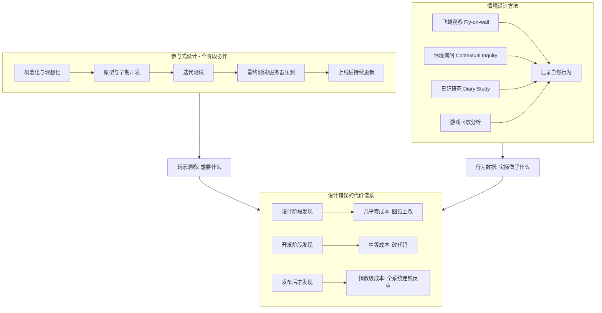

# 第15课：玩家研究与测试

## Learning Objectives

- 理解 **Participatory Design (参与式设计)** 的理念——玩家是合作伙伴而非被动接受者
- 掌握 **Contextual Design (情境设计)** 的核心方法——在真实环境中观察玩家
- 识别 **Design Errors (设计错误)** 与代码bug的区别，理解二者在修复成本上的巨大差异
- 学会运用飞蝇观察、情境询问、日记研究等具体研究方法

## Core Idea

玩家不是游戏的被动接受者，而是积极的**共同创造者**。**Participatory Design** 意味着玩家可以参与从概念化、原型、迭代测试到上线后更新的每一个阶段。**Contextual Design** 则强调在玩家的真实生活环境中观察他们——在咖啡馆、通勤路上、嘈杂的客厅——因为这些环境因素（光线、噪音、干扰、情绪状态）会深刻影响游戏体验。

同时，本课深入剖析了什么叫 **Design Error (设计错误)**——它不是让角色穿墙的代码bug，而是**玩家期望与设计意图之间的错位**，如玩家不知道去哪里、不知道按钮的作用、看不懂UI、Boss难度不合理等。这类错误在开发后期修复的代价极其高昂。

> [!TIP] Key Insight
> **Design Error** 不是代码bug，而是**玩家期望与设计意图之间的错位**。修复设计错误的最佳时机是在它变成"系统性问题"之前——因为一旦系统（如经济系统、UI、任务指引）已经深度耦合，修改一处就会引发连锁反应，修复成本呈指数级上升。**行为比意见更真实**——观察玩家实际上做了什么，远比他们说了什么更能揭示设计问题。

## 参与式设计的阶段

1. **概念化阶段**：在任何代码被写出之前与玩家对话。例如《RuneScape》的投票系统——新技能在开发前需获得75%玩家投票支持
2. **原型与早期开发**：通过Early Access在低成本阶段让玩家介入。《龙之荒野 (Dragon Wilds)》、《Valheim》、《博德之门3》都是典型案例
3. **迭代测试**：与真实玩家进行平衡性测试。《Valorant》在发布前通过玩家测试调整了枪支数据、弹匣容量和角色技能
4. **最终测试**：服务器压力测试与稳定性检查，如《暗黑破坏神4》的开放周末测试
5. **上线后**：持续吸收玩家反馈发布大型补丁，如《博德之门3》的摄影模式、子职业和mod系统

## 参与式设计的常见挑战

- **反馈噪音管理**：有些玩家希望Boss更难，有些希望更简单。需要平衡不同声音，判断反馈是否符合游戏愿景
- **玩家流失**：早期涌入的玩家可能只有少数持续参与。定期更新和保持联系至关重要
- **最吵的不代表最多**：一小部分热情的PvP玩家可能占据70%的反馈量，但他们不代表沉默的大多数
- **内部抵抗**：团队成员的"创意保护主义"或"沉没成本谬误"——"我已经花了17周实现这个系统"
- **冲突的玩家需求**：休闲 vs 硬核、单人 vs 多人、剧情党 vs 战斗党——通过分层系统和可选模式来服务不同群体

## 情境设计的关键方法

- **飞蝇观察 (Fly-on-the-wall)**：在玩家最舒适的环境中坐在他们身后（或通过远程屏幕共享），安静地做笔记，不打断、不解释。记录每一个犹豫、误操作和表情变化
- **情境询问 (Contextual Inquiry)**：观察的同时适时提问——"你刚才为什么绕圈走？" 玩家可能会告诉你"我以为那里有隐藏物品"或"我在检查鼠标是否坏了"。这些"愚蠢"的行为背后往往隐藏着有价值的心理模型信息
- **日记研究 (Diary Study)**：让玩家在每次游戏后记录简短日记，持续数周。例如："今天我下了一个副本，拿到400奖励点才花1欧元，开心了10分钟，然后得去上课。第二天我又下了同样的副本，什么也没掉，很伤心。"
- **游戏回放分析**：录制10个玩家的游戏过程，同步观看，寻找共性模式——"所有人都错过了那个可选钥匙"、"第一个Boss的平均阵亡次数是3次"

## Design Error 案例分析

**案例一：《刺客信条：大革命》的操控错位**。代码运行完美，角色动画流畅，但玩家的经典评价是："当一切正常运作时，我的角色在巴黎天际线上穿行非常满足——关键在于"一切正常运作时"。角色不总是做玩家想让他做的事，这是一个**设计错误而非技术bug**。

**案例二：《魔兽世界》/《上古卷轴：晨风》的早期任务设计**。NPC告诉玩家"向西北走，找一个强盗营地，拿6块灰尘回来"。玩家接受任务后立刻忘记所有细节。这不是bug——是没有系统帮助玩家管理任务信息。现代MMORPG通过任务日志和导航指引解决了这个设计错误。

**案例三：《暗黑破坏神3》拍卖行**。引入真实货币拍卖行后，玩家发现"买装备"比"打装备"更高效，而后者正是ARPG的核心乐趣。关闭拍卖行引发了连锁反应：金币泛滥、掉落率失调、经济系统崩溃、玩家缺乏交易渠道。团队被迫重新设计整个 **Loot 2.0** 系统，包括冒险模式、秘境、赏金、附魔重做等替代方案。

## 实际研究演示

以一款手机射击游戏为例：在咖啡馆中观察4名玩家经历同一伏击场景。玩家1静音游戏，被伏击后懵然不知；玩家2戴普通耳塞，以为踩了陷阱；玩家3用低音量播放，隐约知道被攻击但无法定位；玩家4用降噪耳机，清晰听到身后脚步声，转身反杀。结论：设计错误——只有声音提示，缺少视觉辅助。解决方案：参考《堡垒之夜》的方位指示轮，添加声音来源可视化图标。然后在同一环境中验证修复效果。

## Practice

> [!QUESTION] Self-check
> "行为比意见更真实"——请说明情境设计中"飞蝇观察"和直接"问玩家感受"相比，为什么能发现更深层的问题？

Reveal answer

直接问玩家感受时，玩家给出的答案是经过**理性过滤**的。他们可能会说"游戏还可以"、"Boss有点难"，但这些回答太模糊，无法指导具体的设计改进。更关键的是，**玩家自己也没有意识到**很多影响体验的细节——比如他们在阳光直射下看不清楚UI字体、他们因为环境噪音没听到关键提示音、他们在某个环节不自觉地皱眉是因为颜色对比度不够。

飞蝇观察记录的是**未被过滤的自然行为**：犹豫（表明可供性不清晰）、误操作（表明映射不自然）、快速连续点击（表明因果关系延迟）、中途放下手机（表明上下文设计未考虑碎片场景）。这些行为数据直接告诉你"这里需要改进"，而不需要玩家自己分析。结合情境询问（"你刚才为什么停下来？"）可以进一步挖掘行为背后的心理模型，获得更完整的洞察。

## Next Step

至此，我们已经完成了 Module 2 "以玩家为中心的游戏设计"全部五节课程的学习——从理解游戏为什么失败，到掌握PCGD理念，再到运用可供性、约束、心智模型等工具，最后深入到玩家研究与测试方法。这些知识和工具将帮助你构建真正让玩家喜爱的游戏。继续学习 [[0201-systems-thinking|第16课：系统思维基础]]。
