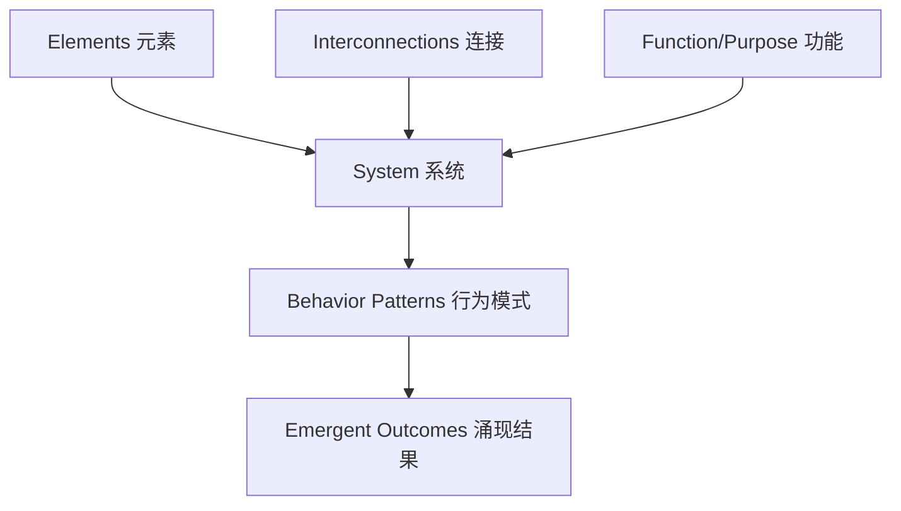

# 第16课：系统思维基础

## Learning Objectives

- 理解系统的定义及其三个核心组成部分：**Elements**、**Interconnections**、**Function/Purpose**
- 认识**系统思维**对游戏设计师的关键价值
- 学会在日常生活中识别系统，并将其抽象为游戏设计素材

## Core Idea

**System**（系统）是一组按照特定模式或结构有序组织和相互连接的**元素**，它们共同产生特定的行为模式，通常体现为其**功能**或**目的**。这一经典定义来自系统思维运动的奠基人 Donella Meadows。

每个系统都由三个核心部分组成：

1. **Elements（元素）**——系统的组成部分，例如大学中的学生和教师。
2. **Interconnections（相互连接）**——元素之间的关联方式，决定了系统的运作模式。例如，教师传授知识，学生吸收知识，学生的成长又促使教师提供更深层次的内容。
3. **Function/Purpose（功能/目的）**——系统的最终目标。大学系统的目的是知识传递，但如果教师更关注职业发展，或学生只在意文凭，系统的实际行为就会偏离目的。

> [!TIP] Key Insight
> 理解系统思维的关键在于：系统中的**连接和目的**往往比元素本身更重要。改变其中一个连接，就可能引发整个系统的连锁反应。这正是游戏设计师需要掌握的强大工具。

## Worked Example

**大学系统分析**：以大学为例，学生和教师是**元素**；教师授课、学生听课、考试反馈是**连接**；知识传递是**目的**。但如果某个学生更在意获得文凭而非学习知识，这个个体目的的变化会如何影响整个系统？它可能导致知识吸收质量下降，进而影响教师的教学策略，最终影响其他学生的学习体验——这就是系统的连锁反应。

**为什么游戏设计师需要系统思维？**

1. **所有游戏都是系统**——即使是叙事驱动的游戏也包含某种系统。理解系统让你能更轻松地识别和改进游戏中的资源流动。
2. **系统思维助力游戏平衡**——理解资源的流动和反馈循环，就能把精力集中在最关键的平衡要素上。
3. **系统思维赋予抽象能力**——你将在万事万物中看到系统，并将现实世界的系统抽象、融入你的游戏设计。

## Practice

> [!QUESTION] Self-check
> 以你最近玩过的一款游戏为例，尝试识别：
> 1. 系统中的三个核心**元素**是什么？
> 2. 这些元素之间有哪些**连接**？
> 3. 系统的**功能/目的**是什么？
> 4. 如果改变其中一个连接，系统会发生什么变化？

Reveal answer

以《文明VI》为例：
1. **元素**：城市、单位、科技树、资源（金币、生产力等）
2. **连接**：城市消耗资源生产单位和建筑；单位探索地图发现新资源；科技树解锁新的建筑和单位；城市产出推动科技发展。
3. **目的**：通过科技、文化、军事或宗教胜利征服世界。
4. **改变连接示例**：如果取消"单位需要维护费"这一连接，玩家将可以无限制地生产军队，系统会偏向军事碾压，其他胜利路径失去意义。

## Next Step

完成了系统思维基础的学习后，请继续前往[第17课：资源与实体](./0202-resources-entities.md)，了解游戏系统中的基本构建块。