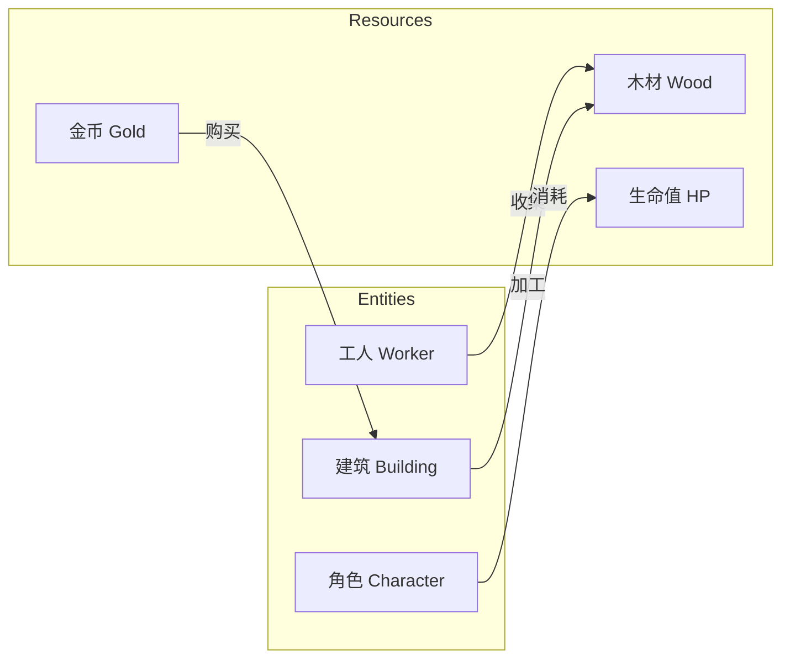

# 第17课：资源与实体

## Learning Objectives

- 区分**Resources（资源）**与**Entities（实体）**的定义与角色
- 掌握三种资源分类维度：**Concrete vs Abstract**、**Tangible vs Intangible**、**Simple vs Complex**
- 理解**Currencies（货币）**作为特殊资源的设计意义
- 掌握系统基本构件：**Sources（源）**、**Stocks（库存）**、**Sinks（汇）**、**Connectors（连接器）**和**Deciders（决策者）**

## Core Idea

在游戏系统中，**资源**是玩家所管理的物品，通过使用**实体**帮助玩家达成目标。**实体**是在被机制激活时存储、使用和/或处理资源的对象。简单来说：资源是被动的（被消耗/转化），而实体是主动的（执行动作）。

**三种资源分类维度：**

1. **Concrete（具体）vs Abstract（抽象）**：具体资源是游戏规则的一部分（如《星际争霸》中的矿物）；抽象资源来自玩家感知（如棋盘上的"局势优势"）。
2. **Tangible（有形）vs Intangible（无形）**：有形资源有物理位置（如《庄园领主》中需要运输的木材）；无形资源没有位置限制（如《星际争霸》中送达基地后的矿物）。
3. **Simple（简单）vs Complex（复杂）**：简单资源单一使用（如金币）；复杂资源有多个属性和用途（如一把剑，兼具攻击力、耐久度等参数）。

**系统基本构件：**

- **Sources（源/供给点）**——向系统中添加资源（用向上的三角表示）
- **Stocks（库存/池）**——存储资源（用圆形表示），通常有最小值和最大值
- **Sinks（汇/消耗点）**——从系统中移除资源（用向下的三角表示）
- **Connectors（连接器）**——表示资源流动的方向（用箭头表示）
- **Deciders（决策者）**——表示玩家的选择点（用菱形表示），可能受资源数量和条件限制

> [!TIP] Key Insight
> 资源和实体的区分类似于面向对象编程中的**变量与类**——资源是被操作的数据，实体是执行操作的对象。在《我的世界》中，木材是资源，而工作台是实体，它将一种或多种资源转化为其他资源。

## Worked Example

**《星际争霸II》中的资源**：矿物和瓦斯气体在地图上以有形资源形式存在，工人需要前往采集点采集并运回基地。一旦送达基地，它们转化为无形资源，玩家可在地图任意位置使用。这种"有形转无形"的设计是RTS游戏的经典模式——它避免了补给线的管理负担，让玩家专注于战斗决策。

**棋子价值的辩论**：象棋中每个棋子的"价值"（皇后 > 车 > 象/马 > 兵）——究竟是具体资源还是抽象资源？严格来说它是抽象资源，因为棋子的价值并非象棋规则的一部分，而是来自棋手的共识和策略判断。但如果修改规则让"吃掉高价值棋子得高分"，它就变成了具体资源。

## Practice

> [!QUESTION] Self-check
> 在一款你熟悉的游戏中，识别：
> 1. 三个**资源**和三个**实体**
> 2. 每种资源属于哪一类（具体/抽象？有形/无形？简单/复杂？）
> 3. 找出一个**Source**、一个**Stock**和一个**Sink**
> 4. 找到一个**决策点**，即玩家需要在不同资源使用方式之间做出选择的地方

Reveal answer

以《我的世界》为例：
1. **资源**：木材（具体、有形、简单）、石头（具体、有形、简单）、生命值（具体、无形、简单）
   **实体**：玩家角色、工作台、熔炉
2. 木材是具体资源（规则中定义用于合成），有形（存在于世界中需采集），简单（单一用途维度）。
3. **Source**：树木（源源不断提供木材）、**Stock**：物品栏（存储所有资源）、**Sink**：熔炉（消耗燃料和矿石）。
4. **决策点**：玩家决定用木材造房子还是做成工具去采矿——这是一个经典的**引擎构建**决策。

## Next Step

掌握了资源与实体的基础后，请继续前往[第18课：系统中的反馈循环](./0203-feedback-loops-systems.md)，深入理解系统的核心动力机制。