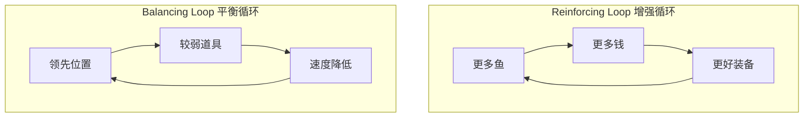

# 第18课：系统中的反馈循环

## Learning Objectives

- 理解**Feedback Loops（反馈循环）**的定义与运作机制
- 区分**Reinforcing（增强/正反馈）**与**Balancing（平衡/负反馈）**两种循环结构
- 认识**Core Loop（核心循环）**、**Progression Loop（进展循环）**与**Meta Loop（元循环）**的层次关系

## Core Idea

**Feedback Loop（反馈循环）**是系统的核心动力机制。简单来说，当一个元素在与一个或多个其他元素连接后反过来**影响自身**，就形成了反馈循环。这使玩家的**过去决策能影响未来的行动可能**，是产生有意义选择和涌现性玩法的关键。

**两类核心反馈循环：**

1. **Reinforcing Loop（增强/正反馈循环）**——放大变化趋势，让好的更好、差的更差。例如《Dredge》中：捕鱼卖钱 -> 买更好的渔网和钓竿 -> 捕到更大更稀有的鱼 -> 卖更多钱 -> 进一步升级。但增强循环也可能反向运作：在《大富翁》中，落后玩家的资源获取机会越来越少，每过一轮都在加速失败。

2. **Balancing Loop（平衡/负反馈循环）**——以目标为导向，让系统趋向稳定或均衡。当拥有越多时资源反而减少，越少时反而增加。经典案例是《马里奥赛车》的**Rubber Banding（橡皮筋效应）**：领先玩家获得绿壳等低级道具，落后玩家获得蓝壳、Bullet Bill等强力道具，使比赛保持紧凑。

**游戏循环的三层架构：**

- **Core Loop（核心循环）**：玩家获取资源并在推进中消耗资源的基本循环。例如《Hades》中战斗 -> 获取资源 -> 回到大厅升级 -> 再次战斗。
- **Progression Loop（进展循环）**：玩家使用核心循环获得的资源推动游戏进展。在《冰汽时代2》中体现为科技树研究和外交关系建设。
- **Meta Loop（元循环）**：玩家从游戏外部引入元素来提升核心和进展循环。例如观看攻略、使用Mod，或在免费游戏中用真实货币购买道具。

> [!TIP] Key Insight
> 增强循环让玩家**感到强大**，平衡循环让游戏**保持挑战**。两者缺一不可：过强的增强循环会导致早期碾压或滚雪球；过强的平衡循环会导致游戏陷入永无止境的停滞。优秀的游戏设计需要在这两者之间找到微妙的平衡。

## Worked Example

**《Dredge》的增强循环**：钓鱼（核心活动）-> 卖鱼换钱 -> 购买更大的渔网和更多钓竿 -> 捕获更大、更稀有的鱼 -> 卖更多钱。这个循环中，鱼和钱是两种资源，鱼商和装备商是两个**转换器（Converter）**。玩家越投入，收益越大——这正是增强循环的魅力。

**《魔兽争霸3》的动态摩擦**：游戏中有一个维持费系统，根据玩家拥有的单位数量减少金币收入。单位越多，获得的金币越少。这创造了一种有趣的策略：玩家可能故意保持小规模军队以积累更多金币，只在确定即将战斗时才爆兵。这不是游戏机制直接规定的，而是由**动态摩擦（Dynamic Friction）**这一平衡模式产生的涌现行为。

## Practice

> [!QUESTION] Self-check
> 分析你最近玩的一款游戏：
> 1. 找出一个**增强循环**——什么因素在自我放大？
> 2. 找出一个**平衡循环**——什么机制在防止玩家过于领先或落后？
> 3. 如果移除这个平衡循环，游戏体验会发生什么变化？
> 4. 识别游戏的**Core Loop**是什么？

Reveal answer

以《文明VI》为例：
1. **增强循环**：拥有更多城市的玩家产出更多科技和金币 -> 更快解锁新科技和建筑 -> 更快建立新城市 -> 进一步扩大优势。
2. **平衡循环**：城市数量增加导致**忠诚度**压力和维护费上升；科技领先时会遇到更积极的AI外交抵制。
3. 如果移除忠诚度机制，文明会变成"滚雪球"游戏——先扩张者必胜，后期无翻盘机会。
4. **Core Loop**：城市管理资源 -> 研究科技/文化 -> 探索地图 -> 与AI互动 -> 管理城市 -> ...

## Next Step

完成反馈循环的学习后，请继续前往[第19课：构建核心玩法](./0204-core-gameplay.md)，了解如何设计引人入胜的核心游戏体验。