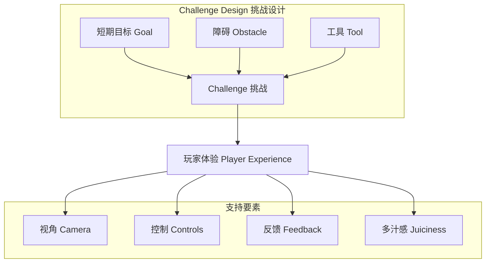

# 第19课：构建核心玩法

## Learning Objectives

- 理解核心玩法的**Challenge Model（挑战模型）**：**Goal（目标）**、**Obstacle（障碍）**、**Tool（工具）**
- 掌握影响核心玩法的四个关键要素：**Camera（视角）**、**Controls（控制）**、**Feedback（反馈）**、**Juiciness（多汁感）**
- 学会设计并整合**Multiple Core Gameplays（多重核心玩法）**

## Core Idea

**Core Gameplay（核心玩法）**是玩家在游戏中最常进行的互动——它是游戏的"动词"。核心玩法的本质是围绕**挑战**而设计。玩家之所以投入游戏，是因为他们想要战胜挑战。

**挑战设计的三要素：**

1. **Short-term Goal（短期目标）**——玩家必须完成才能继续游戏的任务。必须清晰明确、有挑战性但可实现、且玩家能理解实现方法。例如《超级马里奥》中"避免死亡"就是核心的短期目标。
2. **Obstacle（障碍）**——阻止玩家实现目标的游戏特性。包括物理障碍（深坑、敌人）和抽象障碍（计时器、资源限制）。障碍需要多样化以维持游戏乐趣。
3. **Tool（工具）**——帮助玩家克服障碍的游戏特性。给玩家的**选择越多，核心玩法越强**。马里奥的跳跃、火力花、巨人蘑菇都是工具。

**四个支持要素：**

- **Camera（视角）**：选择直接影响玩家舒适度和沉浸感。**第一人称**适合射击游戏但不利于叙事；**第三人称**适合动作冒险但对小团队开发难度高；**等距视角**适合策略和管理类游戏。
- **Controls（控制）**：必须简单直观，尽量使用玩家已经熟悉的操作模式。手机游戏优先使用单指操作；PC游戏以鼠标为主减少键盘依赖。
- **Feedback（反馈）**：玩家的每一个行动都需要**即时**且**成比例**的反馈。正向反馈肯定成功，负向反馈帮助学习。注意手机游戏玩家常关闭声音，应优先使用视觉反馈。
- **Juiciness（多汁感）**：通过视觉特效、动画、音效和镜头震动来增强玩家的感官体验。效果应与玩家行为关联，不宜过度干扰，并保持多样性。

> [!TIP] Key Insight
> 玩家享受游戏的**一半乐趣来自于自己找到答案**，而不是被告知答案。核心玩法应该被设计为一种**学习体验**——玩家通过试错和反馈来掌握克服挑战的技能。

## Worked Example

**《愤怒的小鸟》的核心玩法分析**：
1. **Goal**：摧毁建筑物消灭所有绿色小猪。
2. **Obstacle**：不同的建筑材料（木头、石头、冰块）和建筑结构布局。
3. **Tool**：不同能力的小鸟（普通鸟、分裂鸟、回旋鸟等）。
4. **Feedback**：即时、直观、成比例——小鸟击中目标后，破坏效果立即可见，精准度越高破坏越大。
5. **Controls**：单指操作，向后滑动蓄力，抬手释放。
6. **Juiciness**：羽毛飞散、建筑倒塌、角色表情等细节让每次击中都充满满足感。

**Multiple Core Gameplays**：在《战神》中，玩家同时拥有**近战 combat**和**跑酷攀爬**两种核心玩法。前者需要战术技巧和反应速度，后者需要耐心和精准操作。它们相互独立，在游戏中有各自的应用场景，打破了单一玩法的单调性。

## Practice

> [!QUESTION] Self-check
> 选择一个你熟悉的游戏，分析其核心玩法：
> 1. 核心挑战的**Goal、Obstacle、Tool**分别是什么？
> 2. 游戏的**Camera**类型是否适合核心玩法？
> 3. **Controls**是否满足"简单直观"和"少量"的要求？
> 4. 游戏提供了哪些**正向和负向反馈**？

Reveal answer

以《Celeste》为例：
1. **Goal**：攀登到关卡顶部；**Obstacle**：尖刺、移动平台、限时机关、鬼怪追逐；**Tool**：跳跃、攀爬、冲刺（包括空中冲刺和爬墙跳）。
2. **Camera**：滚动摄像机，完美适合需要精确跳跃的平台游戏，让玩家轻松定位。
3. **Controls**：极简（方向键+跳跃+攀爬+冲刺），玩家几乎不需要学习即可上手。
4. **正向反馈**：到达存档点时的闪光、收集草莓的音效和动画；**负向反馈**：碰触尖刺时角色碎裂的动画和音效，清晰传达死亡信息。

## Next Step

掌握核心玩法的构建后，请继续前往[第20课：参与度玩法](./0205-engagement-gameplay.md)，学习如何让玩家长期保持对游戏的热情。