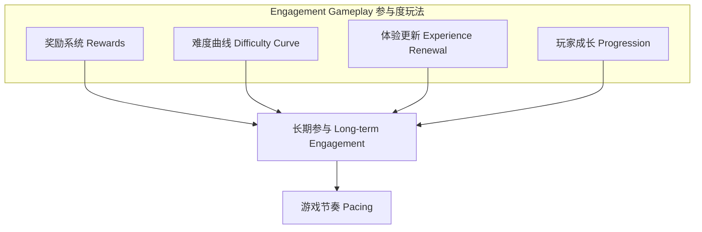

# 第20课：参与度玩法

## Learning Objectives

- 理解**Engagement Gameplay（参与度玩法）**的四大支柱：**Rewards（奖励）**、**Difficulty Curve（难度曲线）**、**Experience Renewal（体验更新）**、**Player Progression（玩家成长）**
- 掌握巴图**Player Types（玩家类型）**分类及其奖励偏好
- 理解**Game Loops（游戏循环）**与**Pacing（节奏）**之间的关系

## Core Idea

**Engagement Gameplay（参与度玩法）**是让玩家持续数天、数月甚至数年玩同一款游戏的特性集合。核心玩法让游戏**有趣**，参与度玩法让玩家**持续游玩**。

**参与度玩法的四大支柱：**

1. **Rewards（奖励）**——分为三个时间维度：
   - **短期奖励**：金币、分数、能力提升。提供即时满足感，教会新手如何游戏（如《超级马里奥》中的金币鼓励玩家跳跃）。
   - **中期奖励**：额外生命、冲破纪录、完成关卡。鼓励持续参与，需要积累才能获得。
   - **长期奖励**：通关、100%收集解锁内容。满足最挑剔的玩家，让硬核玩家深度投入。

2. **巴图 Player Types（玩家类型）**：
   - **Explorer（探索者）**：热爱探索、沉浸和叙事，偏好隐藏地点和收集品奖励。
   - **Killer（杀手）**：追求竞争，想打败他人，享受通过分数获得的奖励。
   - **Socializer（社交者）**：想与他人交流、分享和帮助，偏好社交互动奖励。
   - **Achiever（成就者）**：想展现技能获得认可，喜欢成就、等级和炫耀性奖励。

3. **Difficulty Curve（难度曲线）**——游戏挑战水平随时间的变化。休闲游戏曲线平缓，硬核游戏曲线陡峭。关键在于确保核心玩法有足够的**障碍和工具变体**来支撑不同难度调节。

4. **Experience Renewal（体验更新）**——通过为核心玩法的三个要素（目标、障碍、工具）引入变体来保持新鲜感。例如《潜行者》通过敌人类型、武器变体、环境布局、任务目标等维度不断更新玩家的挑战体验。

> [!TIP] Key Insight
> 如果核心玩法无法支持多样化的变体，请果断放弃它并设计一个新的。在概念阶段改变核心玩法比进入制作几个月后才发现问题要容易得多。

## Worked Example

**《超级马里奥兄弟DS》的奖励系统**：
- **短期**：金币（鼓励跳跃）、分数（激励冒险行为）、能力道具（火球花、巨大化蘑菇）、传送区域。
- **中期**：收集一定数量金币获得额外生命、打破关卡的分数纪录。
- **长期**：通关游戏（对许多玩家来说是终极奖励）。

**《对马岛之鬼》的玩家成长系统**：玩家通过战斗和任务获取经验值，转化为**技巧点**，可在四个技能组（防御、潜行、神话技能、探索）中自由分配。关键在于**选择权**——偏好潜行的玩家可以将技能点投入隐匿相关技能，偏好正面对抗的玩家则投入防御技能。

## Practice

> [!QUESTION] Self-check
> 分析你最喜欢的一款长期运营游戏：
> 1. 它提供了哪些**短期、中期和长期奖励**？
> 2. 它主要吸引哪种**巴图玩家类型**？
> 3. 它通过什么方式**更新玩家体验**以防止重复带来的厌倦？
> 4. 它的**难度曲线**是如何设计的？

Reveal answer

以《Among Us》为例：
1. **短期奖励**：完成任务的即时满足感、成功完成紧急任务的成就感；**中期奖励**：赢下一局游戏、解锁新装扮；**长期奖励**：积累多种皮肤和宠物收藏、与朋友创造独特的游戏回忆。
2. **Socializer（社交者）**和**Killer（杀手）**并重——玩家既享受社交互动，也享受智斗和欺骗的竞争快感。
3. **体验更新**：通过地图变体、任务类型变化、玩家自定义规则和角色装扮来不断更新游戏体验。
4. **难度曲线**：游戏本身难度适中，真正的挑战来自人类玩家的不可预测性——每一局游戏都是独特的社交推理挑战。

## Next Step

掌握了参与度玩法后，请继续前往[第21课：游戏经济设计](./0206-economy-design.md)，探索游戏中的资源流通和价值循环。