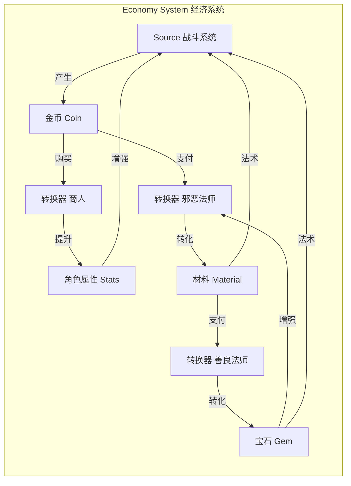

# 第21课：游戏经济设计

## Learning Objectives

- 理解**Currency（货币）**作为专业化资源的独特设计意义
- 掌握**Converter（转换器）**与**Trader（交易者）**两种高级系统组件的区别
- 学会通过**转换链**和**反馈循环**构建游戏经济系统

## Core Idea

游戏经济设计的核心，是理解资源如何在系统中**流动、转换和交换**。货币作为一种特殊资源，因其**高度多功能性**而成为经济系统的枢纽。

**Currency vs. Regular Resources（货币 vs. 常规资源）：**

- **货币**不会被消耗在最终产品中——金币不会变成剑，而是用来**交换**剑。
- **货币**通常具有更高的**多功能性**——木材只能做木制工具，而金币可以买到从铲子到城堡的一切。
- 识别货币有助于理解玩家进展的不同维度。

**Converter vs. Trader（转换器 vs. 交易者）：**

| 特性 | **Converter（转换器）** | **Trader（交易者）** |
|------|----------------------|--------------------|
| 资源处理 | 销毁旧资源，创造新资源 | 不创造也不销毁，只是重新分配 |
| 机制 | 同时激活一个**Source**和一个**Sink** | 在多个**Stock**之间转移资源 |
| 价值参考 | 基于固定公式 | 通常使用**货币**作为价值评估媒介 |
| 示例 | 工作台把木材变为木板 | 《上古卷轴》中商人买/卖物品 |

例如在Minecraft中，将生鸡肉和煤炭放入熔炉加工成熟鸡肉——生鸡肉和煤炭被**消耗**（Sink），熟鸡肉被**创造**（Source），因此熔炉是一个**Converter**。

**三种常见的经济模式：**

1. **Engine Building（引擎构建）**——玩家决定投资资源提升生产来源，还是用于短期收益。《卡坦岛》中，玩家可以选择用资源建造城市（长期提升资源产出）或购买发展卡（短期战略优势）。
2. **Trading Engine（交易引擎）**——资源在实体之间的交换。可以是**静态的**（《Balatro》中盲注价格固定）或**动态的**（《卡坦岛》中玩家间交易价格取决于谈判）。
3. **Economy（经济系统）**——最基础的模式：货币来源 + 转换器提升货币生产率。例如《空手道僵尸土豆》的战斗系统产生金币，金币用于提升攻速或伤害，从而提升战斗表现产生更多金币。

> [!TIP] Key Insight
> 转换链（Conversion Chain）是游戏经济中常见的高级模式——资源经过3-4次转换后才对原始来源产生影响。这种**间接连接**创造了更丰富的策略空间和更有趣的玩家决策。

## Worked Example

**《Baldur's Gate 3》的商人系统**：游戏中的商人是有资金上限的。如果玩家卖给商人太多物品，商人会缺钱，而他们的唯一资金来源就是与玩家的交易——这可能导致玩家无法继续卖出物品的奇怪局面。

**《魔兽争霸3》的维持费系统**：这是一种**动态摩擦（Dynamic Friction）**模式——玩家拥有的单位越多，获得的金币越少。这创造了有趣的策略决策：玩家会故意保持小规模军队以积累足够金币，只在确定即将战斗时才爆兵。这是经济系统直接影响战略决策的典型案例。

## Practice

> [!QUESTION] Self-check
> 选取一款包含经济系统的游戏（如《星露谷物语》、《文明VI》或《欧洲卡车模拟2》）：
> 1. 识别游戏中的**Currency**和**Regular Resources**
> 2. 找到一个**Converter**和一个**Trader**，说明它们的不同
> 3. 绘制该游戏经济的简化**资源流动图**
> 4. 识别一条**转换链**——资源经历了多少次转换才影响核心目标？

Reveal answer

以《星露谷物语》为例：
1. **Currency**：金币（可购买几乎所有物品）；**Regular Resources**：木材、石头、矿石、农作物等（各有特定用途）。
2. **Converter**：熔炉（消耗矿石+煤炭 -> 产生金属锭）；**Trader**：皮埃尔的杂货店（用金币交换种子/物品，不消耗金币也不创造金币）。
3. **简化资源流动**：种植 -> 收获农作物 -> 出售获得金币 -> 购买更高级种子/工具 -> 种植更值钱作物 -> 获得更多金币。
4. **转换链**：矿石（采集）-> 熔炉冶炼（+煤炭消耗）-> 金属锭 -> 制作洒水器 -> 扩大耕种规模 -> 更多作物 -> 更多金币 -> 升级工具 -> 到达矿井更深层获取更稀有矿石。

## Next Step

掌握经济设计后，请继续前往[第22课：系统设计文档](./0207-system-documentation.md)，学习如何用图表和文档有效沟通你的系统设计。