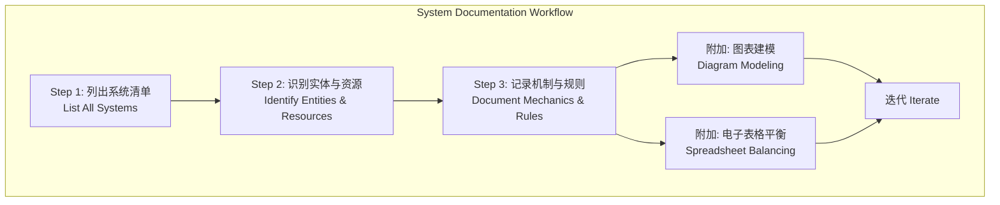

# 第22课：系统设计文档

## Learning Objectives

- 理解**System Documentation（系统文档）**与一般游戏设计文档的差异
- 掌握系统文档化的三个工具：**Diagrams（图表）**、**Spreadsheets（电子表格）**、**Machinations**
- 学会创建美观且可读的**System Diagram（系统图）**
- 掌握系统文档的**三步记录法**

## Core Idea

系统文档不同于传统的**Game Design Document（GDD）**或关卡设计文档。系统文档需要**抽象化地表示资源流动和反馈循环**，使用一套特定的符号体系，并为系统的涌现性留出空间。

**三种文档工具及其适用场景：**

| 工具 | 优势 | 劣势 | 适用场景 |
|------|------|------|----------|
| **静态图表** | 易理解、可共享、通用 | 无法动态模拟 | 概念阶段团队沟通 |
| **电子表格** | 强大平衡能力、数值计算 | 脆弱易损、不直观 | 平衡阶段、数据驱动调整 |
| **Machinations** | 实时模拟系统 | 学习成本高、付费、符号小众 | 大型团队、实时服务游戏 |

**三步记录法：**

1. **列出所有主要系统**——例如战斗系统、经济系统、进展系统。系统中需要多少子系统取决于游戏规模和抽象层级。
2. **识别主要实体和资源**——列出每个系统的核心实体和资源，包括它们的属性和参数。注意实体由**属性**（描述能做什么）和**参数**（具体的数值实现）构成。
3. **详细记录机制和规则**——机制是玩家与系统的互动方式，规则是限制这些互动的边界。从宽泛定义开始，逐步聚焦到每个实体的属性、参数及其互动方式。

**打造美观图表的三个规则：**

1. **留白空间**——不要害怕空白，元素之间留出呼吸空间。填满每一个角落会降低感知价值（就像二手店 vs 奢侈品店的对比）。
2. **颜色有意义**——颜色应为内容服务而不是装饰。例如用棕色表示木材资源，用一种颜色统一表示所有资源、另一种颜色表示实体。
3. **圆形线条**——用圆形线条绘制箭头，因为圆形暗示**运动和活力**，与系统的动态特性吻合。

> [!TIP] Key Insight
> 文档的目的是**沟通**，而不是成为负担。如果你的文档无法让团队成员轻松理解系统，那它就失去了存在的意义。记住：出色的文档不等于出色的游戏——**游戏本身才是最终目标**。

## Worked Example

**《空手道僵尸土豆》经济系统图表建模**：

1. **识别系统**：经济系统——玩家赚取和消费资源以提升力量的方式。
2. **识别资源**：金币（战斗系统产出）、宝石和材料。
3. **识别转换器**：商人（金币 -> 属性提升）、邪恶法师（金币 -> 材料）、善良法师（材料 -> 宝石）。
4. **识别反馈循环**：战斗系统产生金币 -> 金币提升属性 -> 提升的属性让战斗表现更好 -> 产生更多金币。这是一个经典的**经济增强循环**。
5. **绘制图表**：将资源库存排成一行，转换器排在右侧，避免线条交叉。宝石放在顶部，材料在中间，金币在底部。

在记录过程中，你可能会发现遗漏的机会或缺失的交互，也可能发现系统过于复杂需要削减——文档化本身就是一个**迭代和发现**的过程。

## Practice

> [!QUESTION] Self-check
> 选取一款游戏的子系统（如《Hades》的武器升级系统），按照三步记录法：
> 1. 列出该系统的**主要资源**和**实体**
> 2. 绘制一个简化的**系统图**（手绘或用工具）
> 3. 应用三条美学规则（留白、颜色、圆形线条）改进你的图
> 4. 思考：图中的**反馈循环**在哪里？

Reveal answer

以《Hades》的武器升级系统为例：
1. **资源**：黑暗宝石（Darkness）、钥匙（Keys）、仙酒（Nectar）、钻石（Diamonds）；**实体**：夜之圣镜（Mirror of Night）、武器台、各神祇的恩赐房间。
2. **简化系统图**：Source（战斗房奖励）-> Stock（玩家持有资源）-> Decider（选择去哪个房）-> Converter（夜之圣镜用黑暗升级能力）-> 增强战斗表现 -> 更深入冥界获取更多资源。
3. **美学改进**：按颜色分类资源（紫色=黑暗宝石，绿色=钥匙），资源库存排成一排，转换器放在右侧，用圆弧箭头表示资源流向。
4. **反馈循环**：战斗 -> 获得黑暗宝石 -> 升级夜之圣镜 -> 更高能力 -> 在战斗中走得更远 -> 获得更多黑暗宝石。

## Next Step

完成系统文档学习后，请继续前往[第23课：游戏平衡与调优](./0208-balance-tuning.md)，深入理解如何通过模式来平衡和调优你的游戏系统。