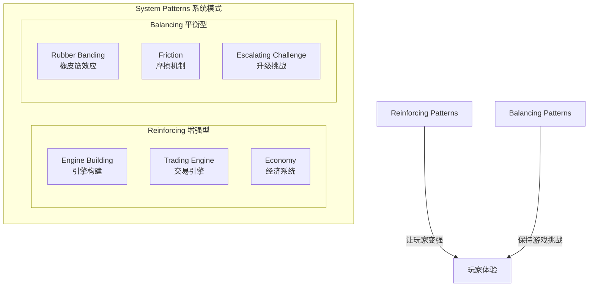

# 第23课：游戏平衡与调优

## Learning Objectives

- 掌握三种常见的**Reinforcing Patterns（增强模式）**和三种**Balancing Patterns（平衡模式）**
- 理解**System Traps（系统陷阱）**及其在游戏设计中的创造性应用
- 学会使用**Setting-Story-Systems（设定-故事-系统）**框架选择适合游戏的系统

## Core Idea

游戏平衡与调优的核心是识别和运用**System Patterns（系统模式）**——解决已知反复出现的设计问题的通用方案。模式不是死板的规则，而是可以根据具体情境调整的**指南**。

**三种增强模式：**

1. **Engine Building（引擎构建）**——玩家需要决定将资源用于提升来源还是短期收益。这个**决策张力**是模式的精髓。《卡坦岛》中：是用资源建城市（长期提升产出）还是买发展卡（短期战略优势）？矿石之所以是《卡坦岛》中最常交易的资源，就因为它与引擎构建模式关系最紧密。
2. **Trading Engine（交易引擎）**——资源在实体之间交换，双方都觉得自己获得了更大价值。在对抗性游戏中，交易同时形成**增强循环**（双方都获益）和**平衡循环**（劣势方在交易中表现更好）。
3. **Economy（经济系统）**——货币来源 + 提升货币生产率的转换器。可以加入**转换链**（经过3-4次转换才影响原始来源），创造更丰富的策略选择。

**三种平衡模式：**

1. **Rubber Banding（橡皮筋效应）**——根据玩家拥有的资源量反向调节资源获取。库存中的资源越多，Source的供给能力越小。《马里奥赛车》的经典实现：落后玩家获得强力道具，领先玩家获得低级道具。
2. **Static Friction vs Dynamic Friction（静态摩擦 vs 动态摩擦）**：
   - **Static**：不考虑当前库存，固定移除一定量资源（如《凯撒3》每年固定税收）。
   - **Dynamic**：根据资源状况调整消耗强度（如《魔兽争霸3》的单位维持费）。
3. **Escalating Challenge（升级挑战）**——根据外部状态增强Sink的强度。游戏进展越多，消耗的资源也越多（如《Balatro》中随着过关次数增加盲注价格）。这在RPG的敌人升级系统中最常见。

**System Traps（系统陷阱）**：在现实世界中，系统陷阱（如"成功者更成功"、军备竞赛、公地悲剧）是破坏性的，但在游戏设计中，你可以**故意使用这些陷阱**来创造有意义的玩家体验：

- **成功者更成功**：几乎所有竞争游戏都利用这一陷阱——用税收系统或橡皮筋效应来调节。
- **军备竞赛**：玩家进展越大，敌人越强（升级挑战模式）。
- **公地悲剧**：多人共享有限资源，工人放置类游戏（如《文化：欧陆风云》）充分利用这一点。
- **规则钻空**：玩家寻找规则漏洞获取优势——有意识地设计规则边界也是一种挑战。

**Setting-Story-Systems（3S框架）**：选择游戏系统时，先确定**Setting（设定）**和**Story（故事情感）**，再构建能增强这两者的**Systems（系统）**。例如，废土生存设定适合制作、交易和战斗系统；疗愈和希望为主题的废土故事更适合建造和生态系统。

> [!TIP] Key Insight
> 模式是可以**组合**的。一个模式可能只是系统的一小部分，你可以将多个模式组合起来产生更大、更复杂的效果。就像烹饪一样，并不是所有调料都适合每一道菜——选择最适合你的游戏的模式组合。

## Worked Example

**《Balatro》的摩擦与升级挑战**：游戏中的盲注价格随着玩家完成的关卡数量而提高——这是一个**升级挑战**模式。同时，这个价格是固定的，不随玩家手头资金变化（**静态摩擦**）。玩家需要决定是存钱吃利息（长期策略），还是花钱提升牌组能力（短期投资）——这又形成了**引擎构建**模式。

**《大富翁》的系统陷阱利用**：
- **成功者更成功**陷阱：拥有更多地产的玩家获得更多租金收入，滚雪球效应。
- **动态摩擦**：税金卡根据玩家财产比例征税。表现越好，缴税越多。
- **失败者的困境**：落后玩家收入机会更少，每过一轮胜率降低。
大富翁巧妙地将现实世界的系统陷阱转化为游戏机制，让"赢家通吃"的竞争体验变得戏剧性。

## Practice

> [!QUESTION] Self-check
> 分析一款你喜欢的游戏中的平衡机制：
> 1. 识别一个**增强模式**和一个**平衡模式**
> 2. 这个平衡模式属于"静态摩擦"还是"动态摩擦"？
> 3. 游戏是否使用了**系统陷阱**？如果有，是如何利用的？
> 4. 使用3S框架分析：游戏的系统是否服务于它的设定和故事？

Reveal answer

以《黑暗之魂》为例：
1. **增强模式**：击败Boss获得魂 -> 升级角色属性 -> 击败更强敌人 -> 获得更多魂（引擎构建）。**平衡模式**：死亡时失去所有魂，必须跑尸取回——这是**动态摩擦**（风险基于当前持有资源量）。
2. **动态摩擦**体现为：你持有的魂越多，死亡惩罚越大；消耗掉魂升级后，惩罚消失。这迫使玩家不断做出"是否回去升级"的决策。
3. **系统陷阱**：游戏利用了"低性能漂移"的变体——玩家表现不佳时（死亡），失去资源，相当于被"降级"。但游戏设计了"捡尸"机制（玩家有一次挽回机会），把纯粹的惩罚转化为紧张的冒险决策。
4. **3S框架**：**设定**是黑暗奇幻世界；**故事**是关于在绝望中坚持、在死亡中学习的旅程；**系统**（死亡掉魂、篝火复活、跑尸）完美强化了"坚韧和冒险"的主题——三个S高度统一。

## Next Step

恭喜你完成了模块3：游戏系统设计的全部课程！请返回[课程主页](../index.md)或继续探索下一个模块。