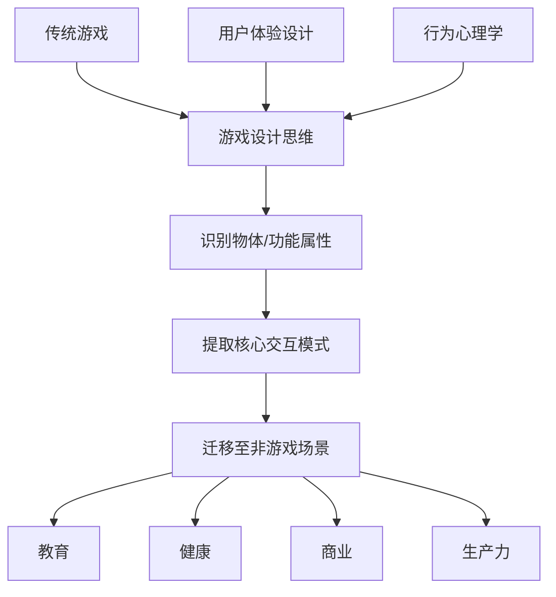
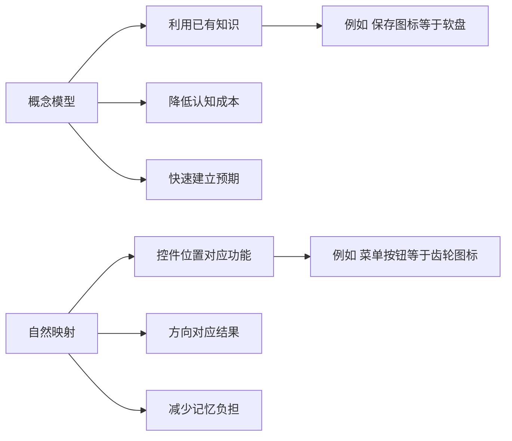

# 第24课：游戏化核心原理

## Learning Objectives

- 理解**游戏化（Gamification）** 的定义及其与完整游戏设计的区别
- 掌握游戏化的三大核心要素：**功能性（Functionality）**、**可用性（Usability）** 与**可供性（Affordance）**
- 学会将游戏设计思维迁移到非游戏场景中的方法论

---

## Core Idea

### 什么是游戏化

**游戏化（Gamification）** 是指将游戏设计元素、游戏思维和游戏机制应用于非游戏情境中，以提升用户参与度、动机和行为改变。不同于开发完整游戏，游戏化关注的是**提取游戏的核心交互模式**，将其植入到教育、健康、商业等场景中。

课程中的核心见解是：每件物品（或功能）都拥有一组**属性（Properties）**，而游戏设计师的能力在于识别这些属性，并将其从一个语境**迁移（Transfer）** 到另一个语境中解决问题。

### 三个核心设计维度

**功能性（Functionality）**：技术层面，某物能够做什么 —— 如"门可以分隔空间并可开合"。在游戏化中，这意味着识别核心机制：签到功能不只是签到，它是一个**循环触发器（Loop Trigger）**。

**可用性（Usability）**：用户理解并操作某物的容易程度。游戏化需要降低认知负担，让用户**不需要教程也能直观地行动**。正如课程中提到的门把手例子：把手形状自然引导用户抓握和旋转，而非需要额外说明。

**可供性（Affordance）**：物体物理属性暗示的可能操作。椅子可以坐，把手可以拉。在游戏化中，**视觉暗示（Visual Cues）** 告诉用户"你可以与此互动"—— 如进度条的填充动画暗示"你可以继续推进"。

> [!TIP] Key Insight
> 游戏化的精髓不在于"添加积分和徽章"，而在于**理解交互的本质**。正如课程中所言："如果你能理解一个物体的功能属性，你可以从另一个物体中提取一两项属性，迁移过来解决当前的问题。" 这就是设计思维的迁移能力。

### 概念模型与映射

游戏化依赖于**概念模型（Conceptual Models）**：使用用户已经熟悉的概念来解释新事物。电脑桌面上的"文件夹"图标就是一个经典的概念模型——它不是真正的文件夹，但人们理解它的工作方式。

**映射（Mapping）** 是指控件与被控对象之间的关系。自然映射（如按钮排列与炉灶火眼对应）能极大地降低学习成本。

---

## Worked Example: 从"门"到"签到系统"

课程中用"门"作为贯穿例子。我们来将此迁移到一个游戏化场景：

**问题**：需要设计一个健身应用的每日签到系统。

1. **分析门的属性**：门将空间分隔；需要特定交互才能通过；通过后有新的空间。
2. **迁移到签到系统**：
   - 门 = 每日签到入口
   - 打开门 = 完成今日任务
   - 门后的空间 = 解锁的新内容/奖励
3. **添加反馈（Feedback）**：每次签到成功，需要像门锁开启一样即时反馈——动画、音效、数值增长。

---

## Practice

> [!QUESTION] Self-check
> 课程中强调"红色桶"在游戏中通常暗示可爆炸物。请运用此原则：在设计一个学习类App时，你希望用户知道"拖动卡片"是核心交互。你会使用哪些**概念模型（Conceptual Models）** 和**可供性（Affordance）** 来暗示这个操作？

Reveal answer

**概念模型**：使用用户熟悉的"翻卡片"或"拖拽拼图"隐喻。卡片边缘略微翘起、下方有阴影，暗示"可拾取"。

**可供性**：
- 卡片在鼠标悬停时轻微放大（暗示可交互）
- 拖拽时卡片跟随光标，原始位置留下残影（反馈）
- 放置目标区域有发光边框（暗示放置位置）
- 成功配对时播放正向音效和粒子效果（正反馈）

这些设计全部来源于课程中讨论的**自然交互原则**：无需文本说明，用户凭直觉就能理解如何操作。

---

## Next Step

Continue with the next lesson or complete the review task above before moving on.
