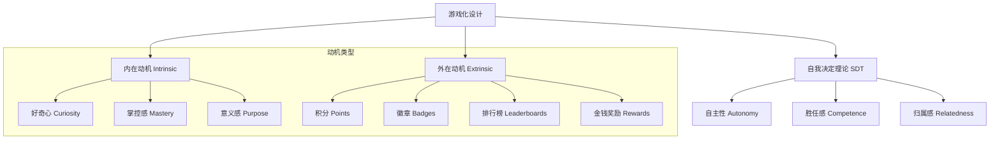

# 第25课：玩家动机分析

## Learning Objectives

- 区分**内在动机（Intrinsic Motivation）** 与**外在动机（Extrinsic Motivation）**
- 掌握**自我决定理论（Self-Determination Theory, SDT）** 的核心三要素
- 理解运气与技能在动机设计中的作用及其平衡策略

---

## Core Idea

### 内在动机与外在动机

**内在动机（Intrinsic Motivation）** 驱动人们做某事是因为事情本身有趣或令人满足 —— 如好奇心、成就感、享受过程。**外在动机（Extrinsic Motivation）** 则来自外部奖励或惩罚 —— 如积分、徽章、排名、金钱。

课程中强调的一个关键观点是：**外在动机可以驱动行为启动，但长期参与依赖于内在动机。** 如果过度依赖外在奖励，可能会产生"过度合理化效应"（Overjustification Effect）—— 当外部奖励消失时，用户的内在兴趣也随之消失。

### 自我决定理论（SDT）

**自主性（Autonomy）**：用户感觉自己有选择权，而非被强迫。在游戏化中，这意味着提供有意义的选项 —— 选择任务路径、自定义角色、决定参与节奏。

**胜任感（Competence）**：用户感觉自己有能力完成挑战。这要求**难度匹配（Difficulty Matching）**—— 课程中详细讨论的"流状态（Flow State）"正是挑战与技能平衡的产物。当难度过高时产生焦虑，过低时产生无聊。

**归属感（Relatedness）**：用户感觉自己与他人有关联。这通过社交功能、团队挑战、排行榜竞争或合作机制来实现。

### 运气与技能的平衡

课程中用了大量篇幅讨论运气（Luck）与技能（Skill）的辩证关系：

- **技能（Skill）**：通过练习可提升的能力，需要理解和实践
- **运气（Luck）**：不可控的随机因素，创造惊喜和不确定性

游戏化设计中，两者的平衡至关重要：

- 纯技能系统会让新手感到沮丧，因为他们无法取得进展
- 纯运气系统会让有经验的用户感到无趣，因为努力得不到回报
- **混合系统**：保证新手有机会成功（运气成分），同时高级用户能通过技能获得优势

> [!TIP] Key Insight
> 课程中提出了一个精辟的见解：**"某个机制包含更多运气成分，并不代表它就更少技能含量。"** 随机掉落加上策略选择，反而可能创造更深层的技能维度。游戏化设计的关键不是消除随机性，而是让随机性服务于动机。

### 属性（Traits）与技能（Skills）的区分

- **属性（Traits）**：用户已有的基础特征（如反应速度、已有知识），通常相对固定
- **技能（Skills）**：用户在参与过程中可以学习和提升的能力

游戏化系统应该让**属性不影响用户体验**，而让**技能成为进步的核心驱动力**。这正是课程中强调的：属性不应该是玩家需要"改善"的东西 —— 它们只是玩家状态的一部分，而技能才是学习与成长的方向。

---

## Worked Example: 语言学习App动机设计

| SDT要素 | 低动机设计 | 高动机设计 |
|---------|-----------|-----------|
| 自主性 | 强制每日固定课程 | 允许选择主题、设定每日目标 |
| 胜任感 | 难度线性增长 | 自适应难度，根据表现调整 |
| 归属感 | 单人练习 | 好友对战、学习小组、排行榜 |

**运气元素**：在复习环节加入"幸运卡牌" —— 随机获得双倍经验或跳过已掌握内容，增加惊喜感。

**技能元素**：发音评分系统，用户可通过练习提高分数，直接体现进步。

---

## Practice

> [!QUESTION] Self-check
> 你正在设计一个健身App的游戏化系统，用户的主要动机是减肥和健康。请识别：
> 1. 哪些激励是**内在动机**，哪些是**外在动机**？
> 2. 如何运用**自我决定理论**来增强长期参与？
> 3. 你会引入哪些**运气元素**来保持新鲜感？

Reveal answer

**1. 内在与外在动机识别：**
- 内在：运动后的愉悦感、体能提升的感受、掌握新动作的成就感
- 外在：徽章、连续签到天数、排行榜排名、虚拟奖励

**2. SDT应用：**
- 自主性：允许用户选择运动类型、时间、个性化计划；不强制完成特定内容
- 胜任感：渐进式难度（从10分钟到30分钟），可视化进步曲线，"你比上周多完成了2组"
- 归属感：加入团队挑战、好友运动对比、教练社区支持

**3. 运气元素：**
- "幸运挑战"随机出现（如"今日双倍积分训练"）
- 完成每日目标后，随机开启"宝藏箱"（额外奖励）
- 抽卡系统获取临时加成道具（如"能量加倍卡"）

关键原则：运气元素是**惊喜调味剂**，而非**核心驱动力**。主要的长期动机应来自内在驱动和SDT三要素。

---

## Next Step

Continue with the next lesson or complete the review task above before moving on.