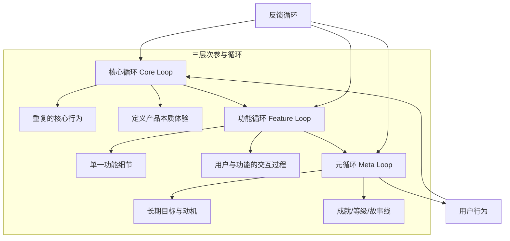
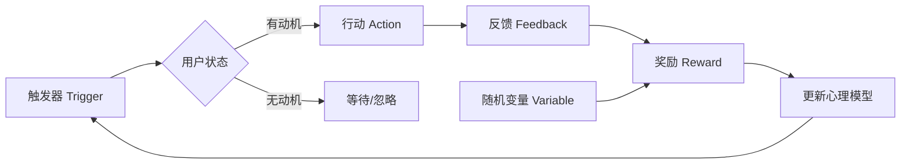

# 第26课：参与循环设计

## Learning Objectives

- 理解**参与循环（Engagement Cycles）** 的三种层次：核心循环、功能循环、元循环
- 掌握**反馈循环（Feedback Loops）** 的类型及其对用户行为的影响
- 学会设计可持续的**用户参与系统**，避免斯金纳箱陷阱

---

## Core Idea

### 三种参与循环层次

课程中将游戏循环明确区分为三个层次，这一框架可以直接迁移到游戏化设计中：

**核心循环（Core Loop）**：用户在使用产品时的**主要重复行为**。例如健身应用：记录运动 -> 获得数据 -> 查看进步 -> 设定新目标 -> 再次记录。核心循环定义了产品的本质体验。

**功能循环（Feature Loop）**：单个功能内部的交互细节。例如"每日挑战"功能：查看挑战 -> 接受挑战 -> 执行任务 -> 领取奖励 -> 挑战更新。

**元循环（Meta Loop）**：用户的**长期动机和目标**。例如年度成就系统、等级体系、故事线解锁。元循环回答了"我为什么要持续使用？"

课程中的关键原则：**功能循环支持核心循环，核心循环推动元循环，元循环让用户的每个动作都有意义。**

### 反馈循环的四种类型

**正反馈循环（Positive Feedback Loop）**：强化当前趋势，使强者愈强、弱者愈弱。在游戏化中，等级越高解锁越多功能，功能越多使用越频繁——这是正反馈，但也可能造成"赢家通吃"。

**负反馈循环（Negative Feedback Loop）**：对抗当前趋势，使系统趋于稳定。例如课程中提到的《魔兽争霸3》维护费机制——单位越多收入越少，缩小玩家差距。在游戏化中，"每日经验上限"就是负反馈，防止用户过度消耗内容。

**静态反馈（Static Feedback）**：保持固定变化率，不随用户状态调整。例如"每完成一个任务获得10积分"，简单可预测。

**随机反馈（Random/Variable Feedback）**：不可预测的奖励。课程中详细讨论了**斯金纳箱（Skinner Box）**——随机奖励产生最强的行为强化效果。这也是老虎机、战利品箱、每日抽奖的设计基础。

> [!TIP] Key Insight
> 课程中提出了一个警醒的观点：**"用户参与度提高，不意味着他们更喜欢你的产品。"** 斯金纳箱式的随机奖励确实能驱动行为，但可能造成"成瘾"而非"满意"。可持续的游戏化应该平衡随机奖励与有意义的选择。

### 触发器设计

**触发器（Triggers）** 是启动用户行为的催化剂。课程中的"门"与交互按钮的讨论直接对应于触发器设计：

- **内部触发器（Internal Trigger）**：用户内心的需求或情绪 —— 无聊时想刷社交媒体
- **外部触发器（External Trigger）**：环境提示 —— 推送通知、红点提示、进度条未完成

有效的触发器需要同时具备：
1. **可供性（Affordance）**：用户知道可以做什么
2. **标志物（Signifier）**：用户知道如何做
3. **反馈（Feedback）**：用户知道做完了

---

## Worked Example: 学习平台参与循环

| 循环层次 | 示例 | 设计要点 |
|---------|------|---------|
| 核心循环 | 观看课程 -> 做笔记 -> 完成测验 -> 查看进度 | 简洁闭环，减少摩擦 |
| 功能循环 | 闪卡复习：看到卡片 -> 回忆答案 -> 翻转确认 -> 标记掌握程度 | 即时反馈，逐步增加间隔 |
| 元循环 | 学期成就、技能树解锁、证书获取 | 提供长期方向感和意义 |

**反馈应用**：学习新主题时使用**正反馈**（连续学习天数增加经验倍率）；设置每日上限使用**负反馈**（防止过度疲劳）；每周抽奖使用**随机反馈**（保持新鲜感）。

---

## Practice

> [!QUESTION] Self-check
> 你正在构建一个习惯追踪App，用户希望养成每日阅读习惯。请设计：
> 1. 一个**核心循环**描述用户的日常行为流
> 2. 至少一种**随机反馈**机制来增加趣味性
> 3. 一个**负反馈**机制来防止过度使用或倦怠

Reveal answer

**1. 核心循环：**
记录阅读 -> 计时/页数追踪 -> 获得经验值 -> 查看连续天数 -> 解锁阅读勋章 -> 记录下一次阅读

**2. 随机反馈机制：**
- "书中宝藏"：每次完成阅读后，随机获得一种奖励（积分加倍、特别书签皮肤、解锁名人名言卡片）
- "阅读盲盒"：连续阅读7天后，开启随机主题推荐（可能是惊喜的新领域）
- 随机性带来期待感，但不能影响核心功能的可用性

**3. 负反馈机制：**
- "休息提醒"：如果单日阅读超过2小时，经验倍率从1.0降至0.5，鼓励可持续节奏
- "内容冷却"：同一本书连续阅读超过3天后，系统推荐切换到其他内容
- 这些负反馈不是"惩罚"，而是**引导健康行为模式**的设计策略

**注意**：避免纯粹的斯金纳箱设计。奖励应该增强而非取代阅读本身的内在乐趣。

---

## Next Step

Continue with the next lesson or complete the review task above before moving on.