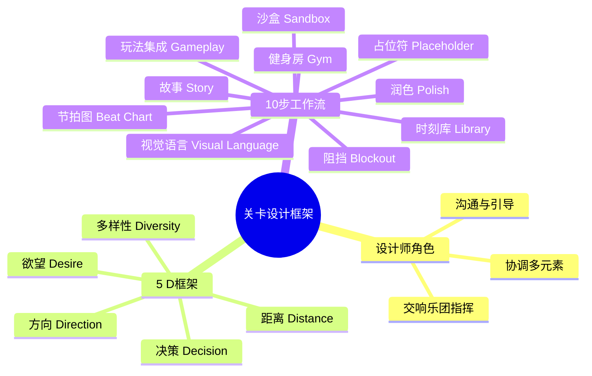
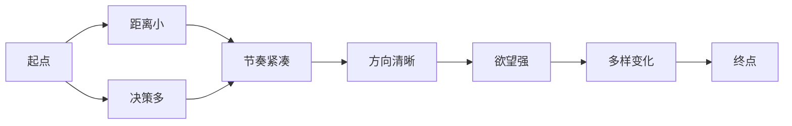

# 第27课：关卡设计框架

## Learning Objectives

- 理解关卡设计师作为"交响乐团指挥"的核心角色，掌握协调游戏机制、美术、叙事与玩家体验的综合视角
- 掌握10步关卡设计工作流，从**健身房（Gym）** 到**润色（Polish）** 的完整流程
- 掌握5 D框架——**Distance（距离）**、**Decision（决策）**、**Direction（方向）**、**Desire（欲望）** 和**Diversity（多样性）**，并应用于关卡分析

## Core Idea

关卡设计不只是放置墙壁和道具，而是将游戏机制、故事、几何形状、世界布局和光照等因素综合协调，为玩家创造有意义的体验。关卡设计师就像**交响乐团指挥（Orchestra Conductor）**，需要将各种"乐器"——射击、跳跃、世界布局、过场动画、NPC、玩家动机——整合在一起，演奏出和谐的乐章。

### 5 D框架详解

**1. Distance（距离）**——独立游戏开发者最常出错的地方。关卡往往太大、太空旷、太无聊。核心原则是"越小越近越好"，可以通过在沙盒中测试跑步时间来校准。在《生化奇兵2》第一关中，从起点到第一个拐角仅需5-10秒，每个区域都被精心控制尺寸。

**2. Decision（决策）**——有趣的选择是游戏设计的首要支柱。给玩家2-5个选项，避免单一选择和超过5个的过载。决策可以来自路径选择、武器选择、是否战斗、如何分配资源等。让玩家拥有掌控感是决策设计的核心目标。

**3. Direction（方向）**——通过视觉引导玩家而不让玩家感到迷茫。明确指引（如地标、颜色、光照）告诉玩家该去哪里，隐晦指引（如捷径、秘密）让玩家有发现的成就感。**白塔（White Tower）** 是经典的远距离地标案例——玩家在关卡中始终能看到它，从而保持方向感。

**4. Desire（欲望）**——让玩家在乎故事、角色、装备和关卡目标。方法包括：让弹药稀缺、给武器命名、通过家庭关系建立情感连接、使用**间歇性强化调度（Intermittent Reinforcement Schedule）** 保持玩家的期待。

**5. Diversity（多样性）**——每个时刻都应该不同。使用**节拍图（Beat Chart）** 规划强度起伏，避免重复单调。打破规则、给玩家惊喜，让关卡体验充满变化。

### 10步关卡设计工作流

1. **Gym（健身房）**：建立基础移动规则——跳跃高度、移动速度、核心能力
2. **Sandbox（沙盒）**：快速实验和原型，不追求美观
3. **Library（时刻库）**：保存好的时刻，方便复用
4. **Beat Chart（节拍图）**：规划强度曲线，标注主要节拍
5. **Blockout（阻挡）**：灰盒搭建，处理距离和流程
6. **Placeholder（占位符）**：用胶囊、方块标记交互元素位置
7. **Visual Language（视觉语言）**：添加地标、门、窗、光照引导
8. **Gameplay Integration（玩法集成）**：加入真实敌人、谜题、拾取物
9. **Story Elements（故事元素）**：触发过场、环境叙事
10. **Polish（润色）**：最后的精修，不再改动主要结构

## Worked Example

以《生化奇兵2》第一关为案例，5秒内在水坑倒影中确立角色身份，通过光照指引玩家方向，在走廊中分散小区域增加风味，用假选择（左转或右转都能到达目标）给予玩家掌控感，通过远处动态元素（影子移动、NPC跑过）引导玩家前进。

## Practice

> [!QUESTION] Self-check
> 选择你熟悉的一款游戏的第一个关卡，用5 D框架分析它：Distance——从起点到第一个事件需要多少秒？Decision——玩家在前30秒内做出了哪些选择？Direction——关卡用了哪些视觉元素引导玩家？Desire——关卡如何让玩家在乎目标？Diversity——前5分钟内体验是否有变化？

Reveal answer

一个完整的5 D分析示例（以《半条命2》为例）：
- **Distance**：从火车下车到第一个combine士兵约15秒，距离控制精准
- **Decision**：初期几乎没有决策，完全线性引导教学，后期逐渐开放选择
- **Direction**：通过光照、NPC动作、目标建筑轮廓持续引导
- **Desire**：通过世界观展示和压迫感建立玩家的反抗动机
- **Diversity**：徒步探索→战斗→驾驶→解谜，节奏变化丰富

每种游戏的权重不同，恐怖游戏可能更侧重Direction和Desire，动作游戏更侧重Decision和Diversity。

## Next Step

Continue with the next lesson or complete the review task above before moving on.