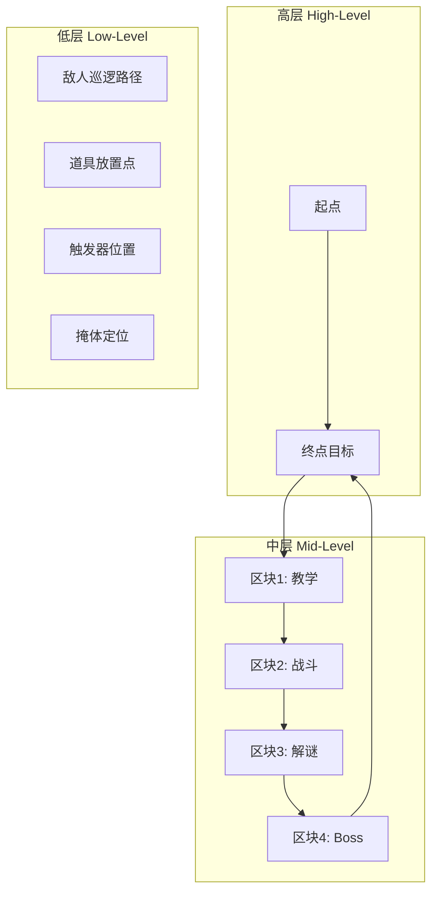
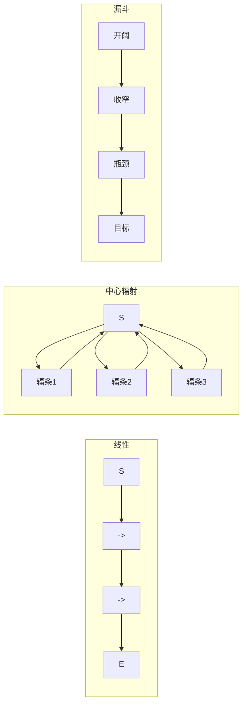

# 第28课：关卡布局与空间设计

## Learning Objectives

- 掌握**高-中-低三层框架（High-Mid-Low Framework）** 分析关卡布局的方法
- 理解七种关卡路径结构及其适用场景：线性、分支、中心辐射、循环、漏斗、双向路径和半开放设计
- 掌握**可供性（Affordance）** 和**标识符（Signifier）** 在玩家引导中的作用

## Core Idea

关卡布局分为三个分析层次：**高层（High-Level）** 定义整体起始点和终点目标；**中层（Mid-Level）** 将关卡分为若干功能区块（战斗区、探索区、解谜区等）；**低层（Low-Level）** 落实到具体的敌人位置、道具放置和触发区域。三者迭代设计，而非线性执行。

### 七种路径结构

1. **Linear（线性）**：玩家从A到B经过固定顺序，最大程度控制体验节奏，适合教学关卡
2. **Linear with Options（线性带选项）**：主线仍为线性，但途中提供左右选择，需确保每个选项都有意义的奖励
3. **Branching（分支）**：不同方向的路径带来截然不同的体验——不同敌人、地形和障碍，给玩家真实的选择权
4. **Hub-and-Spoke（中心辐射）**：玩家从中心出发探索多条"辐条"路线，完成任务后返回中心。适合资源复用，让玩家对中心区域产生熟悉感
5. **Loop（循环）**：玩家绕圈前行，从远处看到目标却无法直达，产生"我要过去"的动机
6. **Funnel & Bottleneck（漏斗与瓶颈）**：从开阔区域逐渐收窄，迫使玩家进入狭窄区域进行近距离遭遇战
7. **Two-Way Road（双向路径）**：去程和回程走不同的路线，避免原路返回的枯燥感

### 高度与视角

**高度（Height）** 是关卡设计中容易被忽视但极为有效的工具。玩家在低位仰望高处产生向上攀登的欲望，在高处俯视低处获得掌控感和策略规划的优势。《最后的生还者2》利用上下起伏的地形让战斗体验始终充满动感。桥、塔、楼梯、坡道、坑洞都是创造高度差异的良好手段。

### 可供性与标识符

**可供性（Affordance）** 是物体的属性提示玩家如何与之交互——门的形状告诉你它可以打开，梯子的横档告诉你它可以攀爬。**标识符（Signifier）** 是具体的视觉或音频提示——门把手、颜色标记、闪烁的光。红色常表示危险或爆炸，蓝色可表示可攀爬面，绿色可表示弹药补给。一旦玩家学会了某种视觉语言，整个关卡的一致性至关重要。

### 展示而非直述

**Show, Don't Tell（展示而非直述）** 是关卡叙事的核心原则。通过环境传递故事——空中的舰队表明入侵正在发生，冒烟的废墟表明战斗已持续多时，NPC的奔跑轨迹暗示前进方向。玩家通过自己发现信息获得智力上的满足感。

## Worked Example

以《狙击精英4》的地中海小镇关卡为例：玩家出生在安全海滩，远处可见冒烟的村庄（白塔式地标），跑向任务点的过程中通过废墟掩体、巡逻士兵路径、旗帜参照点和狙击镜反光等自然元素完成引导。每棵树、每面墙、每个瓶子都有双重目的——既是世界构建的一部分，也是游戏功能的一部分。

## Practice

> [!QUESTION] Self-check
> 在你的游戏引擎或纸上画一张简单的关卡草图：标记起点和终点，标注三种不同的路径类型（例如一段线性走廊、一个中心辐射区域和一个漏斗瓶颈），然后在低层标出至少三个"展示而非直述"的环境叙事元素。每个元素写一句它传达的信息。

Reveal answer

一个完整示例：
- **路径组合**：出生→线性走廊（教学移动）→中心广场（可选三条辐射路线）→漏斗走廊（收窄到Boss房间）
- **展示元素1**：地上散落的士兵头盔和断裂的武器 → "这里发生过激烈战斗"
- **展示元素2**：远处高塔上的旗帜 → "你的目标就在那里"
- **展示元素3**：墙角闪烁的红色油桶 → "这里可以引爆，或者有危险"

关键要点：不要让展示元素成为纯粹的装饰，每个元素都应同时服务于游戏玩法（提示安全/危险/方向/资源）和世界构建（传达故事/氛围/历史）。

## Next Step

Continue with the next lesson or complete the review task above before moving on.