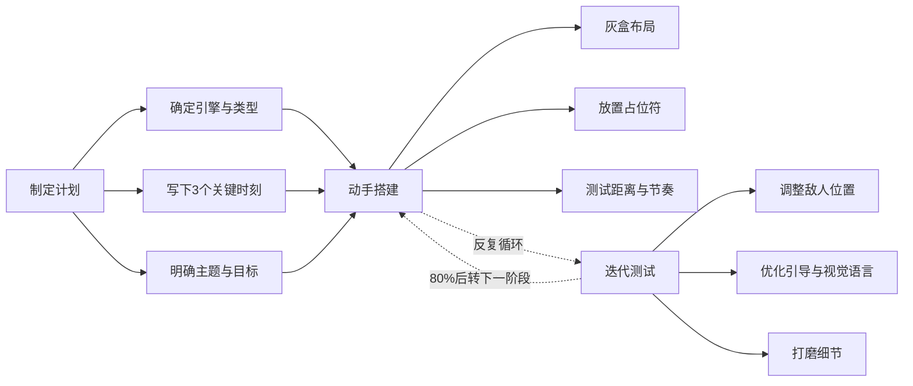

# 第29课：制作关卡实战

## Learning Objectives

- 掌握从概念到可玩关卡的全流程整合方法
- 理解"所有内容做到80分再逐步精进"的迭代哲学
- 学会使用**占位符（Placeholder）** 和**假装（Pretend）** 技巧加速原型

## Core Idea

制作关卡就是将前两课的理论框架转化为可玩的体验。核心方法分为三个阶段：**制定计划（Gameplan）** -- 确定引擎、游戏类型、主题风格和3个关键时刻；**动手搭建（Blockout）** -- 使用灰盒或简易资产快速构建几何结构；**迭代测试（Iterative Testing）** -- 反复跑关、调整距离和流程。

### 三种关卡构建方法

1. **先设计后构建（Design-First）**：在纸上或白板上画好完整草图，确定A点到B点的路径和所有节拍，再进入引擎搭建。适合需要严格预算和时间管理的项目（如游戏开发马拉松）。

2. **探索式构建（Discovery-First）**：先构建一个有趣的世界，加入建筑、地形和装饰，然后在这个世界中寻找自然形成的路径和时刻。适合开放世界或探索驱动的游戏。在打造森林、小镇或废墟的过程中，路径会自然浮现。

3. **混合方法（Hybrid）**：先确定核心时刻和节拍图，然后通过探索式构建来填充细节。这是最实用的方法——在关键节点上有明确规划，在过渡区域保留创意空间。

### 快速原型的关键技巧

- **Pretend（假装）**：没有真实敌人？用胶囊代替并说"假装这是一个敌人"。没有跳跃机制？假装那里有一个跳板。这样可以绕过技术瓶颈，专注于布局和流程
- **Library（时刻库）**：保存你在沙盒中创造的任何一个"感觉对了"的时刻，后续可以直接复用
- **80/80/80规则**：把关卡的每个部分都做到80分水平，再整体提升到85分，而不是把某个角落做到100分而其他地方还是50分
- **快速迭代**：每做几分钟就按下Play跑一遍，感受距离、节奏和玩家的自然选择

### 案例分析：逃出地牢

课程中的实战案例以"逃出地牢"为主题，包含三个时刻：

- **第一时刻：潜行逃脱**——玩家没有武器，被迫在敌人巡逻中寻找出口，利用柱子和高低差躲避追击
- **第二时刻：寻找武器**——玩家到达城堡庭院，从安全的高处俯瞰敌人，通过平台跳跃找到枪械
- **第三时刻：最终决战**——玩家获得武器后面对Boss炮塔和源源不断的敌人，利用掩体逐一击破

整个关卡通过中心辐射结构将三个时刻串联，玩家在中心广场可以观察多条路线，并根据自己的选择决定前进顺序。

## Worked Example

在搭建关卡时，课程通过一段延时录制作了完整演示：从地下城房间开始，逐步加入走廊、楼梯和城堡庭院。在每个环节都反复跳跃、跑步、观察，感受10秒跑步距离是否合适、门的高度是否舒适、视角是否能看见下一个目标。当发现某个跳跃太难时，加入一个可落脚的残骸作为缓冲；当发现敌人位置太密集时，拉开间距并为玩家创造掩体。

## Practice

> [!QUESTION] Self-check
> 选定一个游戏引擎（或纸笔），用30分钟构建一个包含至少3个关键时刻的可玩关卡原型。明确以下内容：1）你的关卡标题和一句话目标（如"逃离监狱"）；2）三个时刻分别是什么（可用胶囊和方块占位）；3）在关卡中标注至少一处"展示而非直述"的环境叙事元素。

Reveal answer

一个成功的关卡原型不需要美术精美，关键在于：
- **流程连贯**：三个时刻之间有自然的过渡和引导
- **距离正确**：从一个节拍到下一个节拍的跑步时间不超过10-15秒
- **玩家选择**：每个时刻至少给玩家一个有意义的选择（路线、战斗或潜行、资源取舍）
- **视觉引导**：玩家不需要说明书就能知道该往哪里走

常见的失败模式：关卡太大太空（距离失控）、一个敌人反复出现（缺乏多样性）、玩家到B点后不知道该回A点还是去C点（方向缺失）。用5 D框架快速自检可以避免这些问题。

## Next Step

Continue with the next lesson or complete the review task above before moving on.