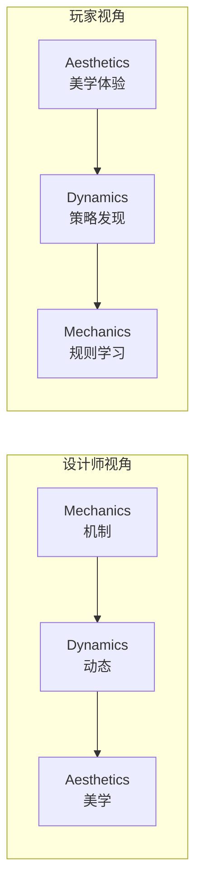

# MDA框架参考

## 框架概览

MDA框架由 Robin Hunicke、Marc LeBlanc 和 Robert Zubek 提出，是游戏设计中最基础的分析框架之一。它将游戏分为三个层次：

| 层次 | 定义 | 示例 |
|------|------|------|
| **Mechanics (机制)** | 游戏的规则系统。玩家可以做什么、不可以做什么，游戏如何响应玩家的行为 | 跳跃、射击、交易、升级规则 |
| **Dynamics (动态)** | 机制被玩家激活后产生的行为模式。机制不是孤立存在的——玩家激活它们时会产生 emergent 行为 | 速通策略、经济不平衡、玩家协作/竞争模式 |
| **Aesthetics (美学)** | 玩家在游戏中体验到的情感反应。这是设计的最终目标 | 成就感、紧张感、探索欲、社交满足 |

> [!TIP] 关键洞察
> 设计师从机制出发走向美学，而玩家从美学体验出发走向机制。理解这个反向关系是设计好游戏的关键。

## 8种美学类型

| # | 类型 | 描述 | 游戏示例 |
|---|------|------|---------|
| 1 | **Sensation (感官)** | 通过感官刺激获得的愉悦 | 《节奏光剑》的音乐与视觉 |
| 2 | **Fantasy (幻想)** | 成为另一个自己的体验 | 《上古卷轴》的角色扮演 |
| 3 | **Narrative (叙事)** | 被故事驱动的体验 | 《最后生还者》的情感叙事 |
| 4 | **Challenge (挑战)** | 克服困难带来的成就感 | 《只狼》的Boss战 |
| 5 | **Fellowship (社交)** | 与他人的互动和协作 | 《Among Us》的社交博弈 |
| 6 | **Discovery (发现)** | 探索未知的乐趣 | 《塞尔达传说》的世界探索 |
| 7 | **Expression (表达)** | 自我表达和创造 | 《我的世界》的建筑创造 |
| 8 | **Submission (消遣)** | 放松和打发时间的体验 | 《糖果粉碎传奇》的休闲匹配 |

> [!WARNING] 常见误区
> 不要试图在一款游戏中满足所有8种美学。专注于 2-3 种核心美学，把它们做到极致，比覆盖所有但浅尝辄止更有效。

## 分析示例：用MDA分析《俄罗斯方块》

| 层次 | 内容 |
|------|------|
| **Mechanics** | 七种方块随机下落；玩家可以旋转和移动方块；填满一行消除 |
| **Dynamics** | 随着速度加快，玩家从"计划放置"变为"本能反应"；方块堆积产生的压力感 |
| **Aesthetics** | Challenge (保持不失败)、Sensation (方块消除的快感)、Submission (容易上手反复游玩的消遣感) |

## 自测练习

> [!QUESTION] 选择一个你熟悉的游戏，用MDA框架分析
> 分别写出它的 Mechanics、Dynamics 和 Aesthetics。注意从设计师和玩家两个视角各分析一遍。

查看分析模板

**游戏名称**：________________

**Mechanics**：
- ________________
- ________________
- ________________

**Dynamics**：
- ________________
- ________________

**Aesthetics (8种中选2-3种)**：
- ________________
- ________________

**设计师到玩家的路径是否一致？**：________________

## 其他游戏设计框架

| 框架 | 提出者 | 核心概念 | 适用场景 |
|------|--------|---------|---------|
| MDA | Hunicke, LeBlanc, Zubek | 机制→动态→美学 | 通用分析框架 |
| Design, Play, Experience (DPE) | 多位学者 | 设计→游玩→体验循环 | 教育游戏设计 |
| 游戏设计原子 (Atomic) | Jesse Schell | 以玩家为中心的解构 | 详细游戏分析 |
| 8 Kinds of Fun | Marc LeBlanc | 八种愉悦来源 | 体验目标设计 |
| Core Loop (核心循环) | 业界实践 | 单次行动到全局循环 | 商业化游戏设计 |

## 参考

- Hunicke, R., LeBlanc, M., & Zubek, R. (2004). *MDA: A Formal Approach to Game Design and Game Research*
- 本课程 Module 1 - 第03课 [[0003-mda-framework]]